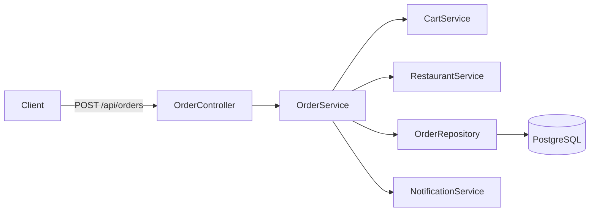
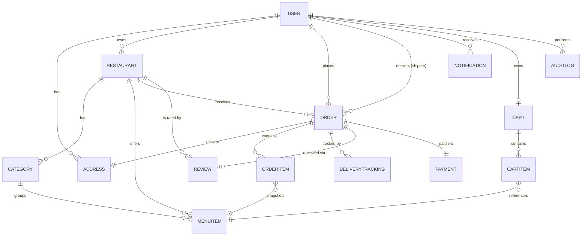
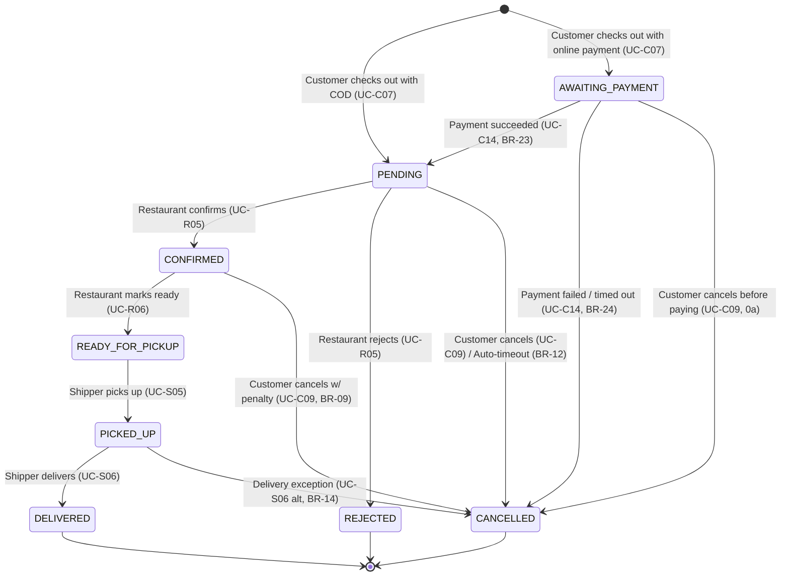

# Software Requirements Specification (SRS)
## Foodya — Food Delivery Platform

| | |
|---|---|
| **Version** | 1.0 |
| **Status** | In-progress |
| **Architecture** | Modular Monolith (Spring Boot) |

---

## Table of Contents

1. [Introduction](#1-introduction)
2. [Overall Description](#2-overall-description)
3. [System Architecture](#3-system-architecture)
4. [Functional Requirements](#4-functional-requirements)
5. [Business Rules](#5-business-rules)
6. [Domain Model](#6-domain-model)
7. [API Specification](#7-api-specification)
8. [Order Status State Machine](#8-order-status-state-machine)
9. [Notifications & Real-Time Updates](#9-notifications--real-time-updates)
10. [Error Handling Strategy](#10-error-handling-strategy)
11. [Non-Functional Requirements](#11-non-functional-requirements)
12. [AI-Assisted Recommendation (Phase 2)](#12-ai-assisted-recommendation-phase-2)
13. [Out of Scope / Future Enhancements](#13-out-of-scope--future-enhancements)
14. [Appendix: Glossary](#14-appendix-glossary)

---

## 1. Introduction

### 1.1 Purpose
This document specifies the functional and non-functional requirements for **Foodya**, a food delivery web/app platform connecting customers, restaurants, and shippers. It is the single source of truth for design and implementation, intended for a solo/small-team build using a **monolithic** backend.

### 1.2 Document Scope
Covers backend system behavior, domain model, API contracts, and quality attributes — including the backend contract for online payment (webhook handling, state transitions), since that's part of core order flow now. Frontend (web/mobile UI) specifics and infrastructure/DevOps are addressed only where they constrain backend design.

### 1.3 Product Scope
**In scope (MVP):**
- Customer ordering flow: browse → cart → order → track → review
- Restaurant management: menu CRUD, order acceptance/preparation
- Shipper delivery flow: accept job → pickup → deliver
- Admin: approvals, user/restaurant moderation, platform oversight
- Payment: **Cash on Delivery (COD) and online payment (VNPay, Momo)**, behind a swappable `PaymentProvider` interface

**Out of scope (MVP):** real-time chat, multi-language i18n, loyalty/coupon engine, stored/tokenized payment methods (see §13).

### 1.4 Definitions & Acronyms

| Term | Meaning |
|---|---|
| SRS | Software Requirements Specification |
| BR | Business Rule |
| UC | Use Case |
| COD | Cash on Delivery |
| JWT | JSON Web Token |
| DTO | Data Transfer Object |
| NFR | Non-Functional Requirement |
| SSE | Server-Sent Events |

### 1.5 Architecture Decision: Modular Monolith

**Decision:** Foodya is built as a **package-by-feature modular monolith** — a single deployable Spring Boot application internally organized into loosely-coupled feature modules, rather than a Hexagonal/Clean Architecture split or a microservices decomposition.

**Rationale:**
- Foodya's domain logic, while non-trivial, does not yet justify the indirection cost (ports/adapters, multiple mapping layers) that a full Hexagonal/Clean split introduces — that cost pays off at higher team size or when infrastructure swapping is a real, near-term need.
- A single deployable Spring Boot application is faster to build, easier to debug end-to-end, and sufficient for the current scale target (§11.4).
- Feature-based packages (`order/`, `restaurant/`, `delivery/`...) keep code organized without forcing a full ports-and-adapters split inside every feature.
- The module boundaries are still respected at the *package* level, so extraction into separate services later (if Foodya ever needs to scale that way) remains possible without a full rewrite — see §3.4.

---

## 2. Overall Description

### 2.1 Product Perspective
Foodya is a standalone three-sided marketplace (Customer / Restaurant / Shipper) with an Admin back-office, built as a single Spring Boot backend serving a web (and optionally mobile) frontend over a REST API.

### 2.2 Actors & Stakeholders

| Actor | Description | Primary Goals |
|---|---|---|
| **Customer** | End user ordering food | Find food fast, order easily, track delivery, get correct order |
| **Restaurant Owner** | Manages a restaurant storefront | Manage menu, receive & fulfill orders, grow revenue |
| **Shipper** | Delivers orders | Find delivery jobs, navigate efficiently, earn income |
| **Admin** | Platform operator | Approve/moderate accounts, monitor platform health, resolve disputes |
| **Guest** (non-actor, pre-auth) | Unauthenticated visitor | Browse restaurants/menus before registering |

### 2.3 Operating Environment / Tech Stack

| Layer | Technology |
|---|---|
| Backend | Java 21, Spring Boot 3 (monolith, single deployable JAR) |
| Database | PostgreSQL |
| Auth | JWT (access + refresh token) |
| Build | Gradle or Maven |
| Payment | COD + online (VNPay, Momo) via a `PaymentProvider` interface |
| Migrations | Flyway/Liquibase (no `ddl-auto: update` in production) |

### 2.4 Assumptions & Dependencies
- A1: Single region deployment; no multi-region/multi-currency requirement for MVP.
- A2: Restaurants and shippers are onboarded with admin approval (not fully self-service) to control marketplace quality early on.
- A3: Delivery fee is computed from actual road distance via a mapping provider (D1), with a straight-line estimate as fallback if the provider call fails (BR-19) — no custom routing engine is built in-house.
- D1: Depends on a third-party mapping provider (e.g., Goong Maps, well-suited to the Vietnamese market) for geocoding (address → coordinates) and road-distance lookups, accessed through a single internal interface so the provider can be swapped without touching domain code.
- D2: Depends on online payment providers (VNPay, Momo) for the ONLINE payment method, accessed through a single internal `PaymentProvider` interface (one adapter per provider) so providers can be added or swapped without touching order/domain logic; COD requires no external dependency.

### 2.5 Constraints
- C1: Two payment methods are supported — COD and online (VNPay, Momo). Online payment depends on provider webhooks and provider-side refunds; COD has no online refund path since no money is collected upfront.
- C2: Monolith must remain horizontally scalable at the process level (stateless API instances behind a load balancer) even though it is not split into services.
- C3: All money values stored as integer (smallest currency unit, e.g., VND has no decimals) to avoid floating-point rounding errors.

---

## 3. System Architecture

### 3.1 Architecture Style
**Layered, package-by-feature monolith.** Each feature module contains its own controller, service, repository, entity, and DTO classes. Cross-feature calls go through a feature's **service interface** (not directly through its repository), keeping a soft boundary that mirrors future service extraction.

```
Request → Controller (REST, validation) 
        → Service (business logic, transactions) 
        → Repository (Spring Data JPA) 
        → PostgreSQL
```

### 3.2 Package Structure

```
com.foodya
├── config/                 # Security, JWT filter, CORS, Swagger, exception handler
├── common/
│   ├── exception/           # Custom exceptions + ApiError DTO
│   ├── dto/                 # Shared base DTOs (PageResponse, ApiResponse)
│   └── util/
├── auth/
│   ├── controller/  service/  repository/  entity/  dto/
├── user/                    # User profile, addresses
│   ├── controller/  service/  repository/  entity/  dto/
├── restaurant/              # Restaurant profile, categories, menu items
│   ├── controller/  service/  repository/  entity/  dto/
├── cart/
│   ├── controller/  service/  repository/  entity/  dto/
├── order/                   # Order, OrderItem, state machine logic
│   ├── controller/  service/  repository/  entity/  dto/
├── payment/                 # Payment entity, webhook handling
│   ├── controller/  service/  repository/  entity/  dto/
│   └── provider/            # PaymentProvider interface + VNPayPaymentProvider, MomoPaymentProvider adapters
├── delivery/                # Shipper assignment, location tracking
│   ├── controller/  service/  repository/  entity/  dto/
├── review/
│   ├── controller/  service/  repository/  entity/  dto/
├── notification/
│   ├── controller/  service/  repository/  entity/  dto/
├── admin/                   # Approval & moderation endpoints (composes other services)
└── FoodyaApplication.java
```

**Rule:** a module may call another module's `*Service` interface, but never another module's `*Repository` or `*Entity` directly. This is the one discipline carried over from Hexagonal thinking — it's cheap to enforce and is what makes future extraction possible. The same discipline applies one level deeper for external integrations: `order/` and `payment/` never call VNPay/Momo/Goong Maps SDKs directly — only through the `PaymentProvider` / mapping-provider interface, so swapping or adding a provider touches one adapter class, not business logic.

### 3.3 Request Flow (Place Order example)



### 3.4 Future Extraction Path (not in current scope)
If Foodya later needs independent scaling (e.g., `delivery` module under heavy GPS-update load while `order` isn't), the package boundary plus the "service-interface-only" rule means that module's code can be lifted into its own Spring Boot app with comparatively low rework — the same pattern used in the Grab-clone project, but deferred here until there's an actual scaling need.

---

## 4. Functional Requirements

### 4.1 Use Case Overview

| Actor | Use Cases |
|---|---|
| Customer | UC-C01..UC-C14 |
| Restaurant Owner | UC-R01..UC-R07 |
| Shipper | UC-S01..UC-S07 |
| Admin | UC-A01..UC-A06 |

### 4.2 Customer Use Cases

**UC-C01 — Register**
- Precondition: Email not already registered.
- Main flow: Customer submits email, password, full name, phone → system validates → creates User (role=CUSTOMER, status=ACTIVE) → sends verification (optional MVP) → returns JWT pair.
- Alternative: 1a. Email already exists → 409 Conflict, error code `AUTH_EMAIL_TAKEN`.
- Postcondition: User created and authenticated.

**UC-C02 — Login**
- Primary identifier: **email** (not username). The system looks up the user by email, then verifies the password. `username` is a display/profile field only and is not used for authentication.
- Main flow: Submit email + password → validate credentials → issue access + refresh token pair.
- Alternative: 1a. Invalid credentials → 401, `AUTH_INVALID_CREDENTIALS` (see BR-02 for rate limiting). 1b. Account banned → 403, `AUTH_ACCOUNT_BANNED`. 1c. Account with that email not found → same 401 as 1a (do not distinguish — avoids email enumeration).

**UC-C03 — Browse / Search Restaurants**
- Main flow: Guest or Customer lists restaurants, optionally filtered by name, category, or location radius → paginated results sorted by distance or rating.
- Alternative: No restaurants match filter → return empty list with 200 (not an error).

**UC-C04 — View Restaurant Menu**
- Main flow: Select restaurant → view categories and items, with availability flags.
- Alternative: Restaurant closed/suspended → menu still viewable, "currently closed" banner shown; ordering disabled (see UC-C08 alt flow).

**UC-C05 — Manage Cart**
- Main flow: Add/update/remove menu items in cart, scoped to one restaurant at a time.
- Alternative: 1a. Adding item from Restaurant B while cart has items from Restaurant A → prompt to clear cart first (BR-05). 1b. Item becomes unavailable while in cart → flagged at checkout, not silently removed.

**UC-C06 — Manage Delivery Addresses**
- Main flow: Create/update/delete saved addresses; mark one as default.
- Alternative: Attempt to delete the only address → blocked, `ADDRESS_LAST_ONE`, must add another first if in use by a pending order.

**UC-C07 — Checkout / Place Order**
- Precondition: Cart non-empty; customer has at least one address.
- Main flow:
  1. Customer reviews cart, selects delivery address, chooses payment method: COD or Online (VNPay or Momo).
  2. System validates restaurant is open and all items still available (BR-06).
  3. System computes road distance via the mapping provider (falls back to straight-line if the provider call fails, BR-19) and derives the shipping fee (BR-07); total = subtotal + shipping fee.
  4. Customer confirms order.
  5. System creates Order + OrderItem snapshot rows and a Payment record, clears cart.
     - **If COD:** Order status = `PENDING`, Payment.status = `PENDING` (flips to `SUCCESS` on delivery, BR-28); restaurant is notified immediately.
     - **If Online:** Order status = `AWAITING_PAYMENT` (BR-23), Payment.status = `PENDING`; system calls the chosen `PaymentProvider` to create a payment session and gets back a redirect URL. Restaurant is **not** notified yet.
  6. System returns order ID, status, and — for online — the payment redirect URL.
- Alternative:
  3a. Restaurant closed → 422, `RESTAURANT_CLOSED`, order not created.
  3b. One or more items out of stock → 422 with list of affected items, `ITEMS_UNAVAILABLE`; customer must update cart.
- Postcondition: Order in `PENDING` (COD, restaurant notified) or `AWAITING_PAYMENT` (Online, restaurant not yet notified) — see §9.

**UC-C08 — Track Order**
- Main flow: Customer polls or subscribes (SSE) to order status and, once a shipper is assigned, their last known location.
- Alternative: Order already `DELIVERED`/`CANCELLED` → tracking returns final state, no live location.

**UC-C09 — Cancel Order**
- Main flow: Customer cancels while order is `AWAITING_PAYMENT`, `PENDING`, or `CONFIRMED`.
- Alternative: 0a. Status is `AWAITING_PAYMENT` → no payment was completed, nothing to refund; cancels immediately. 1a. Status is `PENDING` → free cancellation. 1b. Status is `CONFIRMED` → cancellation allowed but flagged with a cancellation count against the customer (BR-09); if paid online, a refund is issued (BR-25). 1c. Status is `READY_FOR_PICKUP` or later → cancellation blocked, `ORDER_NOT_CANCELLABLE`.

**UC-C10 — Rate & Review Order**
- Precondition: Order status = `DELIVERED`.
- Main flow: Customer submits rating (1–5) + optional comment, scoped to that order → restaurant's aggregate rating recalculated.
- Alternative: Attempt to review twice for same order → blocked, `REVIEW_ALREADY_EXISTS`.

**UC-C11 — View Order History**
- Main flow: Paginated list of past orders with status and totals.

**UC-C12 — Manage Profile**
- Main flow: Update name, phone, avatar; change password (requires current password).

**UC-C13 — Logout / Refresh Token**
- Refresh flow: Client sends refresh token → system validates, generates new access token, returns same refresh token unchanged.
- Logout flow: Client sends refresh token in request body → system denylists the token server-side (BR-03) → returns 200; client discards both tokens locally. Subsequent use of that refresh token returns 401 `AUTH_TOKEN_REVOKED`.
- Alternative: Refresh token is expired or not found in server store → 401, `AUTH_TOKEN_REVOKED`.

**UC-C14 — Confirm Online Payment (webhook-driven)**
- Precondition: Order in `AWAITING_PAYMENT`.
- Main flow:
  1. Customer completes payment on the provider's hosted checkout page (redirected from UC-C07); Foodya never sees card/wallet credentials (BR-27).
  2. The provider sends an asynchronous webhook to Foodya's payment callback endpoint.
  3. The matching provider adapter verifies the webhook signature (BR-26) and translates it into Foodya's internal payment event, keyed by `provider_txn_ref`.
  4. If valid and successful: Payment.status = `SUCCESS`, Order moves `AWAITING_PAYMENT` → `PENDING` (BR-23), restaurant is now notified (§9).
  5. System responds 200 to the provider to acknowledge receipt.
- Alternative:
  3a. Invalid signature → reject with 400, log as a security event, no state change (BR-26).
  3b. Duplicate webhook for an already-processed `provider_txn_ref` → return 200 without reprocessing (BR-26).
  4a. Provider reports failure → Payment.status = `FAILED`, Order moves `AWAITING_PAYMENT` → `CANCELLED` (BR-24); customer notified.
  4b. No webhook arrives within the timeout window (15 minutes) → a scheduled sweep cancels the order with reason `PAYMENT_TIMEOUT` (BR-24).
- Postcondition: Order in `PENDING` (success) or `CANCELLED` (failure/timeout); Payment reflects the final state.

### 4.3 Restaurant Owner Use Cases

**UC-R01 — Register Restaurant**
- Main flow: Owner (existing or new User) submits restaurant profile (name, address, phone, opening hours) → status=`PENDING` → awaits Admin approval (UC-A02).
- Alternative: Submission incomplete (missing required fields) → 400 validation error.

**UC-R02 — Manage Menu Categories**
- Main flow: CRUD categories scoped to own restaurant; reorder via `display_order`.

**UC-R03 — Manage Menu Items**
- Main flow: CRUD menu items (name, price, description, image, category, availability toggle).
- Alternative: Attempt to delete an item referenced by past OrderItems → soft-delete only (item hidden, not removed) to preserve order history integrity (BR-10).

**UC-R04 — View Incoming Orders**
- Main flow: Restaurant views orders in `PENDING` status, newest first, with sound/visual + push notification. Orders still in `AWAITING_PAYMENT` are not shown — they don't exist for the restaurant until payment succeeds (BR-23).

**UC-R05 — Confirm / Reject Order**
- Main flow: Owner confirms (`PENDING`→`CONFIRMED`) or rejects (`PENDING`→`REJECTED`, with reason) within a response window (BR-11).
- Alternative: No response within window → system may auto-cancel and notify customer (BR-12, configurable).

**UC-R06 — Update Preparation Status**
- Main flow: Owner marks `CONFIRMED`→`READY_FOR_PICKUP` when food is ready; shippers in range are then notified (§9).

**UC-R07 — View Restaurant Dashboard**
- Main flow: View revenue summary, order count, and rating trend over a selected date range.

### 4.4 Shipper Use Cases

**UC-S01 — Register as Shipper**
- Main flow: Submit profile + vehicle info → status=`PENDING_APPROVAL` → awaits Admin approval (UC-A03).

**UC-S02 — View Available Delivery Jobs**
- Main flow: List orders in `READY_FOR_PICKUP` near shipper's current location, not yet assigned.

**UC-S03 — Accept Delivery Job**
- Main flow: Shipper accepts → Order.shipper_id set, order status unchanged (`READY_FOR_PICKUP`) but now "claimed."
- Alternative: Two shippers attempt to accept simultaneously → optimistic locking ensures only the first succeeds; the second receives `JOB_ALREADY_TAKEN` (BR-13).

**UC-S04 — Update Location**
- Main flow: Shipper's client periodically POSTs lat/lng while an active delivery is in progress; stored as DeliveryTracking rows and broadcast to the customer (§9).

**UC-S05 — Mark Picked Up**
- Main flow: `READY_FOR_PICKUP` → `PICKED_UP`; customer notified.

**UC-S06 — Mark Delivered**
- Main flow: `PICKED_UP` → `DELIVERED`; customer notified, review prompt triggered (UC-C10 enabled). For COD orders, this also flips Payment.status `PENDING` → `SUCCESS`, recording the moment cash was actually collected (BR-28); for online orders, Payment was already `SUCCESS` from UC-C14 and is unaffected by delivery.
- Alternative: Customer unreachable / refuses order → shipper marks a delivery exception (BR-14), order moves to `CANCELLED` with reason; for COD, Payment stays `PENDING`→ effectively void (cash never collected); for online, a refund is issued (BR-25). Admin notified for follow-up.

**UC-S07 — View Earnings**
- Main flow: List completed deliveries with per-order fee and date-range totals.

### 4.5 Admin Use Cases

**UC-A01 — Manage Users**
- Main flow: Search/filter users; ban/unban with reason → action recorded in AuditLog (BR-20).

**UC-A02 — Approve/Reject Restaurant**
- Main flow: Review pending restaurant → approve (`PENDING`→`APPROVED`, now visible to customers) or reject (with reason, owner notified) → recorded in AuditLog (BR-20).

**UC-A03 — Approve/Reject Shipper**
- Main flow: Same pattern as UC-A02 for shipper accounts; recorded in AuditLog (BR-20).

**UC-A04 — Platform Analytics**
- Main flow: View aggregate order volume, GMV, active restaurants/shippers over time.

**UC-A05 — View Platform Configuration**
- Main flow: Admin views the currently effective configuration values (base shipping fee, per-km rate, owner response window §BR-11, cancellation penalty threshold §BR-09) for transparency/debugging. These values live in application configuration (`application.yml`, overridable per environment via environment variables), not in a database table — changing them goes through the normal code review + deploy process, not a runtime admin action. This keeps day-one config changes auditable via git history rather than needing a separate audit/cache layer for values that rarely change.

**UC-A06 — Handle Disputes**
- Main flow: View flagged orders/reviews (e.g., reported by a party), take action — for online-paid orders, trigger a provider refund (BR-25); for COD, there's nothing to refund since cash was never collected upfront — plus remove review, warn/ban account as needed → recorded in AuditLog (BR-20).

---

## 5. Business Rules

| ID | Rule |
|---|---|
| BR-01 | A User has exactly one role at creation: CUSTOMER, RESTAURANT_OWNER, SHIPPER, or ADMIN. Role is not self-changeable after registration. |
| BR-02 | Login endpoint is rate-limited to 10 requests/minute per IP to mitigate brute force. |
| BR-03 | Refresh tokens are stored server-side (or denylisted on logout) so logout is effective immediately, not just client-side token deletion. |
| BR-04 | JWT access token TTL = 24h; refresh token TTL = 30 days. |
| BR-05 | A Cart belongs to exactly one Restaurant at a time; adding an item from a different restaurant requires clearing the existing cart. |
| BR-06 | An order can only be placed if the restaurant status is APPROVED and currently within opening hours, and all cart items are `is_available = true`. |
| BR-07 | Shipping fee = base fee + (road_distance_km × per_km_rate); road_distance_km comes from the mapping provider (BR-19). Base fee and per_km_rate are defined in application configuration, not hardcoded inline in business logic. |
| BR-08 | All monetary fields are stored as integers in the smallest currency unit; no floating point arithmetic on money. |
| BR-09 | A customer who cancels a `CONFIRMED` order more than N times in a rolling 30-day window (N is an application-configured constant, default 3) is flagged for review by Admin (UC-A06). |
| BR-10 | Menu items referenced by any historical OrderItem are never hard-deleted; deletion is a soft "is_available=false" + hidden flag. |
| BR-11 | Restaurant owner response window for PENDING orders = 5 minutes by default, set via application configuration. |
| BR-12 | If a restaurant does not respond within BR-11's window, the order is auto-cancelled with reason `RESTAURANT_TIMEOUT` and customer is notified. |
| BR-13 | Order-to-shipper assignment uses optimistic locking (version column) on Order; concurrent accept attempts fail for all but the first. |
| BR-14 | A delivery exception (customer unreachable, wrong address, refused order) ends the order as CANCELLED with a structured reason code; no in-app refund logic exists because payment is COD. |
| BR-15 | A Review can be created only once per Order, and only when Order.status = DELIVERED. |
| BR-16 | Restaurant.rating_avg is recalculated as a simple arithmetic mean on every new Review (acceptable at MVP scale; revisit if volume grows). |
| BR-17 | A Restaurant or Shipper account must be APPROVED by Admin before it becomes active/visible (BR applies to UC-R01, UC-S01). |
| BR-18 | OrderItem stores a snapshot of item name and price at order time; later menu price changes never retroactively alter historical orders. |
| BR-19 | Road distance for an order is fetched once at checkout from the mapping provider and stored on the Order (`distance_km`); if the provider call fails or times out, the system falls back to a straight-line estimate and flags the order's `distance_source` as `FALLBACK` for later review. |
| BR-20 | Every Admin moderation action (ban/unban, restaurant or shipper approval/rejection, dispute resolution) writes an AuditLog row with actor, action, target, reason, and timestamp. AuditLog rows are append-only — never updated or deleted. |
| BR-21 | *(removed — rule merged into BR-17: the APPROVED requirement already covers both restaurant and shipper visibility)* |
| BR-22 | Any column storing a coordinate (`Address.latitude/longitude`, `Restaurant.latitude/longitude`, `DeliveryTracking.latitude/longitude`) is enforced at the database level with `CHECK (latitude BETWEEN -90 AND 90)` and `CHECK (longitude BETWEEN -180 AND 180)`. |
| BR-23 | An order paid online starts in `AWAITING_PAYMENT` and is invisible to the restaurant (UC-R04) until the provider confirms success and it moves to `PENDING`; a COD order skips this state and starts directly at `PENDING`. |
| BR-24 | If an online payment fails, is declined, or no provider confirmation arrives within 15 minutes, the order moves to `CANCELLED` with reason `PAYMENT_FAILED` or `PAYMENT_TIMEOUT`; the cart is not automatically restored — the customer re-orders if they still want it. |
| BR-25 | For an online-paid order cancelled before `PICKED_UP`, the system issues a refund via the same provider's refund API (best-effort, asynchronous); for COD, no refund logic applies since no money was collected upfront. |
| BR-26 | Every payment webhook is verified against the sending provider's signature before processing, and processed idempotently keyed by `provider_txn_ref` — a duplicate delivery from the provider never double-applies a state change. |
| BR-27 | Foodya never stores raw card numbers or wallet credentials; every online payment redirects the customer to the provider's own hosted checkout page, keeping card/wallet data entirely outside Foodya's systems. |
| BR-28 | Every Order has exactly one Payment row regardless of method. For COD, Payment.status starts `PENDING` and flips to `SUCCESS` only when the shipper marks the order `DELIVERED` (UC-S06) — that's the moment cash is actually collected. For online, Payment.status is driven entirely by provider webhooks (BR-23–BR-26) and is never touched by delivery events. |
| BR-29 | When an online payment fails or times out (BR-24), **no payment retry is allowed on the same Order** — the order moves to `CANCELLED` and the customer must place a new order. This keeps Order state transitions simple and unambiguous; a retry would require resetting Order status which violates the terminal-state invariant (§8.2). |
| BR-30 | `User.status` values: `ACTIVE` (default on registration), `BANNED` (set by Admin via UC-A01, blocks login with `AUTH_ACCOUNT_BANNED`). No other status values exist; account deactivation is always done via `BANNED`, not by deleting the row (deletion is blocked by FK constraints — see §6.4). |
| BR-31 | `Restaurant.status` values: `PENDING` (on creation, not visible to customers), `APPROVED` (visible and orderable), `REJECTED` (owner notified with reason, can resubmit), `SUSPENDED` (set by Admin for policy violation via UC-A06, same visibility as `PENDING`; owner notified). Only `APPROVED` restaurants are returned by the public restaurant listing (§7.3). |
| BR-32 | A `ShipperProfile` row is created alongside the `User` when a shipper registers (UC-S01). It holds vehicle-specific data (vehicle type, license plate) and a separate `status` field (`PENDING_APPROVAL` → `APPROVED` / `REJECTED`) managed by Admin (UC-A03). The `User.role = SHIPPER` is set on registration but the shipper cannot accept delivery jobs until `ShipperProfile.status = APPROVED` (BR-17). |
| BR-33 | Every HTTP request receives a unique `traceId` (UUID v4) generated by a servlet filter (`TraceIdFilter`) at the start of request processing. The value is stored in the MDC under key `traceId` so it appears in all log lines for that request, and is written into every `ApiResponse` via `ApiResponse.setTraceId(...)`. Business code never generates or sets `traceId` manually. |

*(Numbering left open above BR-33 for future additions; cross-reference BR IDs from use case alternative flows as new rules are added.)*

---

## 6. Domain Model

### 6.1 Entity Summary

| Entity | Key Attributes |
|---|---|
| **User** | id, email, username, password_hash, full_name, phone, role (`CUSTOMER`\|`RESTAURANT_OWNER`\|`SHIPPER`\|`ADMIN`), status (`ACTIVE`\|`BANNED` — BR-30), created_at |
| **ShipperProfile** | id, user_id (FK → User, unique), vehicle_type, license_plate, status (`PENDING_APPROVAL`\|`APPROVED`\|`REJECTED` — BR-32), rejection_reason, created_at |
| **Address** | id, user_id, label, recipient_name, phone, street, ward, district, city, latitude, longitude, is_default |
| **Restaurant** | id, owner_id, name, description, address, latitude, longitude, phone, status (`PENDING`\|`APPROVED`\|`REJECTED`\|`SUSPENDED` — BR-31), opening_hours, rating_avg, created_at |
| **Category** | id, restaurant_id, name, display_order |
| **MenuItem** | id, restaurant_id, category_id (FK → Category), name, description, price (integer, BR-08), image_url, is_available, is_deleted (soft-delete flag — BR-10), created_at |
| **Cart** | id, customer_id, restaurant_id, updated_at |
| **CartItem** | id, cart_id, menu_item_id, quantity, note |
| **Order** | id, customer_id, restaurant_id, shipper_id (nullable), delivery_address_id, status, subtotal (integer), shipping_fee (integer), distance_km, distance_source (`PROVIDER`\|`FALLBACK`), total (integer), version (optimistic lock — BR-13), cancel_reason, created_at, confirmed_at, picked_up_at, delivered_at, cancelled_at |
| **OrderItem** | id, order_id, menu_item_id (FK kept for analytics — BR-18), item_name_snapshot, item_price_snapshot (integer), quantity, subtotal (integer) |
| **DeliveryTracking** | id, order_id, shipper_id, latitude, longitude, recorded_at |
| **Review** | id, order_id, customer_id, restaurant_id, rating (1–5), comment, created_at |
| **Notification** | id, user_id, type, title, message, is_read, related_order_id (nullable), created_at |
| **AuditLog** | id, actor_user_id, action, target_type, target_id, reason, created_at |
| **Payment** | id, order_id, method (`COD`\|`ONLINE`), provider (`VNPAY`\|`MOMO`\|`null` for COD), status (`PENDING`\|`SUCCESS`\|`FAILED`\|`REFUNDED`), provider_txn_ref, amount (integer), paid_at, created_at |

**Status enum notes:**
- `User.status`: `ACTIVE` (default), `BANNED` — see BR-30.
- `Restaurant.status`: `PENDING` → `APPROVED` / `REJECTED`; `APPROVED` → `SUSPENDED` (admin action) — see BR-31.
- `ShipperProfile.status`: `PENDING_APPROVAL` → `APPROVED` / `REJECTED` — see BR-32.
- `Payment.status`: `PENDING` → `SUCCESS` or `FAILED`; `SUCCESS` → `REFUNDED` (online only, BR-25).
- `username` on `User` is a profile display field. Login uses `email` (UC-C02). `username` must be unique but is not the authentication identifier.

### 6.2 Entity-Relationship Diagram



### 6.3 Relationship Notes
- `Cart` is 1:1 with an active checkout session per customer (one open cart at a time, scoped to one restaurant — BR-05).
- `OrderItem` does **not** have a live foreign-key dependency on `MenuItem.price` for display — it snapshots name/price into `item_name_snapshot` / `item_price_snapshot` (BR-18); the FK to `MenuItem` is kept for analytics/traceability only and is never followed at query time for price display.
- `Order.shipper_id` is nullable until UC-S03 assignment occurs.
- `AuditLog` is append-only and references its target generically (`target_type` + `target_id`) rather than a typed FK per target, since a single admin action can target a User, Restaurant, or Shipper account.
- `Payment` is mandatory 1:1 with `Order` (BR-28) — every order has exactly one Payment row whether COD or online; `provider` is null for COD, populated (`VNPAY`/`MOMO`) for online.
- `ShipperProfile` is 1:1 with `User` (only users with `role = SHIPPER` have one). It is created atomically in the same transaction as the User row during shipper registration (UC-S01). The `User` row alone does not grant delivery capabilities — `ShipperProfile.status = APPROVED` is also required (BR-32).
- `MenuItem.category_id` is a non-nullable FK to `Category` (RESTRICT on category delete — see §6.4). Before deleting a category, all items in it must be reassigned or soft-deleted first; the service layer enforces this, not the DB cascade.

### 6.4 Data Integrity Constraints

**Foreign key behavior** (beyond the default `RESTRICT`):

| Relationship | On Delete | Rationale |
|---|---|---|
| `Address.user_id` → `User` | RESTRICT | A user can't be deleted while addresses reference them; deactivate via `User.status` instead. |
| `MenuItem.category_id` → `Category` | RESTRICT | Prevents orphaned items; category must be reassigned/removed explicitly first. |
| `OrderItem.menu_item_id` → `MenuItem` | RESTRICT (never CASCADE) | MenuItem is soft-deleted only (BR-10), so this FK should never actually fire a delete in practice. |
| `CartItem.cart_id` → `Cart` | CASCADE | Deleting a cart (e.g., after checkout) should clear its items. |
| `DeliveryTracking.order_id` → `Order` | CASCADE | Tracking history has no independent meaning once its Order is gone. |
| `Notification.related_order_id` → `Order` | SET NULL | A notification can remain (for history) even if its related order is later purged; only the link is cleared. |
| `Payment.order_id` → `Order` | RESTRICT | A Payment row is a financial record; it must never disappear as a side effect of an Order operation. |

**Check constraints:**
- `latitude BETWEEN -90 AND 90` and `longitude BETWEEN -180 AND 180` on every coordinate column (`Address`, `Restaurant`, `DeliveryTracking`) — BR-22.
- `rating BETWEEN 1 AND 5` on `Review.rating`.
- `quantity > 0` on `CartItem.quantity` and `OrderItem.quantity`.
- `price >= 0`, `subtotal >= 0`, `shipping_fee >= 0`, `total >= 0`, `Payment.amount >= 0` on all monetary columns.
- `Payment.method IN ('COD', 'ONLINE')`; `Payment.provider IN ('VNPAY', 'MOMO')` when `method = 'ONLINE'`, `NULL` when `method = 'COD'`.

---

## 7. API Specification

### 7.1 Conventions
- Base path: `/api/v1`
- Auth: `Authorization: Bearer <access_token>` on all endpoints except `/auth/register`, `/auth/login`, public restaurant browsing.
- Request bodies are plain JSON (not wrapped) — the envelope below applies to **responses** only.
- **Response envelope** — every client-facing response, success or error, is wrapped in one `ApiResponse` shape (`common/dto/ApiResponse`, `@JsonInclude(NON_NULL)` so absent fields are omitted entirely, not sent as `null`):
```json
{
  "success": true,
  "message": "Human-readable string",
  "data": {},
  "meta": { "page": 0, "size": 10, "total": 100 },
  "code": "ERROR_CODE",
  "timestamp": "2026-06-22T10:15:00Z",
  "traceId": "uuid"
}
```
  - `meta` appears only on paginated list endpoints (omitted otherwise).
  - `code` appears only on error responses (omitted on success).
  - `traceId` is a UUID v4 generated by `TraceIdFilter` (a `OncePerRequestFilter`) at the start of each request, stored in MDC under key `traceId` so it appears in every log line for that request, and written into the response via `ApiResponse`. Business code never generates or sets `traceId` manually — see BR-33.
  - Controllers only ever return one of six factory calls — no ad-hoc response shapes: `ApiResponse.success(message, data)`, `ApiResponse.success(message, data, meta)`, `ApiResponse.error(message)`, `ApiResponse.error(message, data)`, `ApiResponse.error(message, errorCode)`, `ApiResponse.error(message, data, errorCode)`.
- **Exception:** the payment webhook endpoint (§7.4.1) does **not** use this envelope — the provider calling it doesn't parse Foodya's JSON shape, it only needs an HTTP status to know whether to stop retrying.

### 7.2 Auth

```
POST /api/v1/auth/register
POST /api/v1/auth/login
POST /api/v1/auth/refresh
POST /api/v1/auth/logout
POST /api/v1/auth/change-password   (authenticated)
```

**POST /auth/login — Request**
```json
{ "email": "user@example.com", "password": "secret123" }
```
**Response 200**
```json
{
  "success": true,
  "message": "Login successful",
  "data": {
    "accessToken": "eyJ...",
    "refreshToken": "eyJ...",
    "expiresIn": 86400,
    "user": { "id": "uuid", "fullName": "Nguyen Van A", "role": "CUSTOMER" }
  },
  "timestamp": "2026-06-22T10:15:00Z",
  "traceId": "550e8400-e29b-41d4-a716-446655440000"
}
```
**Response 401**
```json
{
  "success": false,
  "message": "Invalid email or password",
  "code": "AUTH_INVALID_CREDENTIALS",
  "timestamp": "2026-06-22T10:15:00Z",
  "traceId": "550e8400-e29b-41d4-a716-446655440000"
}
```

**POST /auth/logout — Request**
```json
{ "refreshToken": "eyJ..." }
```
**Response 200**
```json
{
  "success": true,
  "message": "Logged out successfully",
  "timestamp": "2026-06-22T10:15:00Z",
  "traceId": "550e8400-e29b-41d4-a716-446655440000"
}
```
*The server denylists the refresh token (BR-03). The client must discard both access and refresh tokens locally. Subsequent calls using this refresh token return 401 `AUTH_TOKEN_REVOKED`.*

**POST /auth/refresh — Request**
```json
{ "refreshToken": "eyJ..." }
```
**Response 200**
```json
{
  "success": true,
  "message": "Token refreshed",
  "data": {
    "accessToken": "eyJ...",
    "refreshToken": "eyJ...",
    "expiresIn": 86400
  },
  "timestamp": "2026-06-22T10:15:00Z",
  "traceId": "550e8400-e29b-41d4-a716-446655440000"
}
```

**POST /auth/change-password — Request** *(requires Bearer token)*
```json
{ "currentPassword": "old", "newPassword": "new", "confirmPassword": "new" }
```
**Response 200**
```json
{
  "success": true,
  "message": "Password changed successfully",
  "timestamp": "2026-06-22T10:15:00Z",
  "traceId": "550e8400-e29b-41d4-a716-446655440000"
}
```

### 7.3 Restaurant & Menu

```
# Public (no auth required)
GET  /api/v1/restaurants?lat=&lng=&radiusKm=&search=&cuisine=&minRating=&sortBy=&page=&size=
GET  /api/v1/restaurants/{id}
GET  /api/v1/restaurants/{id}/menu

# Owner (RESTAURANT_OWNER role, own restaurant only)
POST   /api/v1/restaurants                          (creates restaurant with status=PENDING)
PUT    /api/v1/restaurants/{id}
PATCH  /api/v1/restaurants/{id}/toggle-status       (open/close for orders)

# Categories (owner)
POST   /api/v1/restaurants/{id}/categories
PUT    /api/v1/restaurants/{id}/categories/{catId}
DELETE /api/v1/restaurants/{id}/categories/{catId}  (blocked if category has active items — RESTRICT)
PATCH  /api/v1/restaurants/{id}/categories/reorder  (update display_order)

# Menu Items (owner)
GET    /api/v1/restaurants/{id}/menu-items          (includes inactive — owner view)
POST   /api/v1/restaurants/{id}/menu-items
PUT    /api/v1/restaurants/{id}/menu-items/{itemId}
PATCH  /api/v1/restaurants/{id}/menu-items/{itemId}/toggle-availability
DELETE /api/v1/restaurants/{id}/menu-items/{itemId} (soft-delete only — BR-10)
```

**GET /restaurants/{id}/menu — Response 200**
```json
{
  "success": true,
  "message": "Menu retrieved",
  "data": {
    "restaurantId": 5,
    "categories": [
      {
        "id": 1, "name": "Main Course",
        "items": [
          { "id": 101, "name": "Pho Bo", "price": 45000, "isAvailable": true }
        ]
      }
    ]
  },
  "timestamp": "2026-06-22T10:15:00Z",
  "traceId": "550e8400-e29b-41d4-a716-446655440000"
}
```

**GET /restaurants — Response 200 (paginated — shows `meta`)**
```json
{
  "success": true,
  "message": "Restaurants retrieved",
  "data": [
    { "id": 5, "name": "Pho Hung", "ratingAvg": 4.6, "status": "APPROVED" }
  ],
  "meta": { "page": 0, "size": 20, "total": 134 },
  "timestamp": "2026-06-22T10:15:00Z",
  "traceId": "550e8400-e29b-41d4-a716-446655440000"
}
```

### 7.4 Cart & Orders

```
GET    /api/v1/cart
POST   /api/v1/cart/items
PATCH  /api/v1/cart/items/{id}
DELETE /api/v1/cart/items/{id}
POST   /api/v1/orders                     (checkout — COD or online)
GET    /api/v1/orders/{id}
GET    /api/v1/orders/{id}/payment        (poll payment status — fallback if a webhook is delayed)
GET    /api/v1/orders                     (history, paginated)
PATCH  /api/v1/orders/{id}/cancel
```

**POST /orders — Request (COD)**
```json
{
  "addressId": 7,
  "paymentMethod": "COD",
  "note": "No coriander please"
}
```
**Response 201 (COD)**
```json
{
  "success": true,
  "message": "Order placed successfully",
  "data": {
    "id": 990,
    "status": "PENDING",
    "subtotal": 90000,
    "shippingFee": 15000,
    "distanceKm": 3.2,
    "distanceSource": "PROVIDER",
    "total": 105000,
    "payment": { "method": "COD", "status": "PENDING" },
    "createdAt": "2026-06-22T10:15:00Z"
  },
  "timestamp": "2026-06-22T10:15:00Z",
  "traceId": "550e8400-e29b-41d4-a716-446655440000"
}
```

**POST /orders — Request (Online)**
```json
{
  "addressId": 7,
  "paymentMethod": "ONLINE",
  "provider": "VNPAY",
  "note": "No coriander please"
}
```
**Response 201 (Online — awaiting payment)**
```json
{
  "success": true,
  "message": "Order created, awaiting payment",
  "data": {
    "id": 991,
    "status": "AWAITING_PAYMENT",
    "subtotal": 90000,
    "shippingFee": 15000,
    "total": 105000,
    "payment": {
      "method": "ONLINE",
      "provider": "VNPAY",
      "status": "PENDING",
      "redirectUrl": "https://provider.example/checkout/abc123"
    },
    "createdAt": "2026-06-22T10:15:00Z"
  },
  "timestamp": "2026-06-22T10:15:00Z",
  "traceId": "550e8400-e29b-41d4-a716-446655440000"
}
```
**Response 422 (item unavailable)**
```json
{
  "success": false,
  "message": "Some items are no longer available",
  "data": [ { "menuItemId": 101, "name": "Pho Bo" } ],
  "code": "ITEMS_UNAVAILABLE",
  "timestamp": "2026-06-22T10:15:00Z",
  "traceId": "550e8400-e29b-41d4-a716-446655440000"
}
```

### 7.4.1 Payment Webhook (internal contract)

```
POST /api/v1/payments/webhook/{provider}   (provider = vnpay | momo — signature-verified, not user-facing)
```

Each provider sends its own wire format; the matching adapter in `payment/provider/` verifies the signature and translates it into one **internal normalized event** before anything else in the system sees it — `OrderService` and `NotificationService` never know which provider was involved:

```json
{
  "providerTxnRef": "TXN-9F2A1",
  "orderId": 991,
  "result": "SUCCESS",
  "amount": 105000
}
```

This is the shape every adapter produces, regardless of whether the raw webhook came from VNPay or Momo (BR-26) — adding a third provider later means writing one more adapter that emits this same shape, not touching `OrderService`. **Note:** this JSON is purely internal (adapter → `OrderService`); what Foodya actually sends back to the provider is just an HTTP 200/4xx, not an `ApiResponse` body (§7.1).

### 7.5 Restaurant-Side Order Management

```
GET   /api/v1/restaurant/orders?status=PENDING
PATCH /api/v1/restaurant/orders/{id}/confirm
PATCH /api/v1/restaurant/orders/{id}/reject
PATCH /api/v1/restaurant/orders/{id}/ready
```

### 7.6 Shipper

```
GET   /api/v1/shipper/jobs?lat=&lng=&radiusKm=
PATCH /api/v1/shipper/jobs/{orderId}/accept
PATCH /api/v1/shipper/orders/{id}/pickup
PATCH /api/v1/shipper/orders/{id}/deliver
POST  /api/v1/shipper/location
GET   /api/v1/shipper/earnings?from=&to=
```

**PATCH /shipper/jobs/{orderId}/accept — Response 409 (race lost)**
```json
{
  "success": false,
  "message": "This delivery was already accepted by another shipper",
  "code": "JOB_ALREADY_TAKEN",
  "timestamp": "2026-06-22T10:15:00Z",
  "traceId": "550e8400-e29b-41d4-a716-446655440000"
}
```

### 7.7 Admin

```
GET   /api/v1/admin/users?status=
PATCH /api/v1/admin/users/{id}/ban
GET   /api/v1/admin/restaurants?status=PENDING
PATCH /api/v1/admin/restaurants/{id}/approve
PATCH /api/v1/admin/restaurants/{id}/reject
GET   /api/v1/admin/shippers?status=PENDING
PATCH /api/v1/admin/shippers/{id}/approve
GET   /api/v1/admin/analytics/overview?from=&to=
```

### 7.8 Reviews & Notifications

```
POST  /api/v1/orders/{id}/review
GET   /api/v1/restaurants/{id}/reviews?page=&size=
GET   /api/v1/notifications?page=&size=
PATCH /api/v1/notifications/{id}/read
PATCH /api/v1/notifications/read-all
```

---

### 7.9 User Profile & Addresses

```
# Profile (authenticated, own account)
GET  /api/v1/users/me
PUT  /api/v1/users/me

# Delivery Addresses (authenticated, own addresses)
GET    /api/v1/users/me/addresses
POST   /api/v1/users/me/addresses
GET    /api/v1/users/me/addresses/{id}
PUT    /api/v1/users/me/addresses/{id}
DELETE /api/v1/users/me/addresses/{id}    (blocked if address referenced by a non-terminal order)
PATCH  /api/v1/users/me/addresses/{id}/set-default
```

**GET /users/me — Response 200**
```json
{
  "success": true,
  "message": "Profile retrieved",
  "data": {
    "id": "uuid",
    "email": "user@example.com",
    "username": "nguyenvana",
    "fullName": "Nguyen Van A",
    "phone": "+84901234567",
    "role": "CUSTOMER",
    "status": "ACTIVE",
    "profileImageUrl": "https://...",
    "createdAt": "2026-01-01T00:00:00Z"
  },
  "timestamp": "2026-06-22T10:15:00Z",
  "traceId": "550e8400-e29b-41d4-a716-446655440000"
}
```

**POST /users/me/addresses — Request**
```json
{
  "label": "Home",
  "recipientName": "Nguyen Van A",
  "phone": "0901234567",
  "street": "123 Nguyen Trai",
  "ward": "Phuong 3",
  "district": "Quan 5",
  "city": "Ho Chi Minh",
  "latitude": 10.762622,
  "longitude": 106.660172,
  "isDefault": false
}
```

*Notes:*
- `DELETE /addresses/{id}`: returns 422 `ADDRESS_LAST_ONE` if this is the user's only address and a non-terminal order references it (UC-C06 alt flow).
- `PATCH /addresses/{id}/set-default`: sets `is_default = true` on the target and `false` on all others for that user (atomic).

---

## 8. Order Status State Machine

### 8.1 State Diagram



### 8.2 Transition Table

| From | To | Trigger / Actor | Side Effects |
|---|---|---|---|
| — | PENDING | Customer checkout with COD (UC-C07) | Cart cleared, restaurant notified immediately |
| — | AWAITING_PAYMENT | Customer checkout with online payment (UC-C07) | Cart cleared, customer redirected to provider checkout; restaurant **not** notified yet |
| AWAITING_PAYMENT | PENDING | Provider confirms payment success (UC-C14, BR-23) | Restaurant notified — order becomes visible to them for the first time |
| AWAITING_PAYMENT | CANCELLED | Customer cancels before paying (UC-C09, alt 0a) | No payment completed, nothing to refund; restaurant never sees this order; cart not restored (BR-29) |
| AWAITING_PAYMENT | CANCELLED | Payment failed or timed out (UC-C14, BR-24) | Customer notified; restaurant never sees this order; cart not restored (BR-29) |
| PENDING | CONFIRMED | Restaurant confirms (UC-R05) | Customer notified |
| PENDING | REJECTED | Restaurant rejects (UC-R05) | Customer notified with reason |
| PENDING | CANCELLED | Customer cancels (UC-C09), or system auto-timeout (BR-12) | No penalty; restaurant notified if applicable |
| CONFIRMED | READY_FOR_PICKUP | Restaurant marks ready (UC-R06) | Nearby shippers notified (§9) |
| CONFIRMED | CANCELLED | Customer cancels (UC-C09) | Cancellation count incremented (BR-09); refund issued if paid online (BR-25); restaurant notified |
| READY_FOR_PICKUP | PICKED_UP | Shipper picks up (UC-S05) | Customer notified, live tracking begins |
| PICKED_UP | DELIVERED | Shipper delivers (UC-S06) | Customer notified; review window opens (UC-C10); for COD, Payment flips to `SUCCESS` (BR-28) |
| PICKED_UP | CANCELLED | Delivery exception (UC-S06 alt, BR-14) | Admin notified for manual follow-up; refund issued if paid online (BR-25) |

**Invariant:** Once an order reaches `DELIVERED`, `REJECTED`, or `CANCELLED`, no further transitions are permitted (terminal states), enforced at the service layer regardless of any direct DB access. `AWAITING_PAYMENT` is the only state the restaurant never sees (BR-23).

**Implementation note:** `Order.updateStatus(newStatus)` in the service layer must validate the transition against the table above and throw `InvalidOrderStateException` (→ 422 `ORDER_NOT_CANCELLABLE` or a new `INVALID_ORDER_TRANSITION` code) if the transition is not in the allowed set. No status change may bypass this check — including admin actions.

---

## 9. Notifications & Real-Time Updates

| Event | Delivery Mechanism | Recipient |
|---|---|---|
| Online payment succeeded | Push/SSE | Customer + Restaurant Owner (order just became visible to them) |
| Online payment failed / timed out | Push/SSE | Customer |
| New order placed (COD, or online after payment success) | Push/SSE | Restaurant Owner |
| Order confirmed/rejected | Push/SSE | Customer |
| Order ready for pickup | Push/SSE (broadcast to nearby shippers) | Shipper pool |
| Order picked up / delivered | Push/SSE | Customer |
| Shipper location update | SSE stream (server → customer client) | Customer (during active delivery only) |
| Restaurant/Shipper approval result | Push | Restaurant Owner / Shipper |

**Pattern used:** **SSE** for all server→client one-directional pushes (order status, location updates to the customer), since the customer only consumes updates and never sends real-time data back on the same channel. Shipper **location upload** (client→server) is a simple periodic `POST /shipper/location` rather than a persistent WebSocket — at MVP scale, short-interval polling/posting is simpler to operate than maintaining bidirectional connections, and can be upgraded to WebSocket later if update frequency demands it.

---

## 10. Error Handling Strategy

### 10.1 Approach
A single `@RestControllerAdvice` global exception handler maps domain exceptions to `ApiResponse.error(...)` calls (§7.1), so feature services throw typed exceptions (e.g., `RestaurantClosedException`) and never construct response bodies directly. The handler picks the right factory overload based on whether the exception carries extra data (e.g., a list of unavailable items) and an error code.

### 10.2 Standard Error Response Format
```json
{
  "success": false,
  "message": "Some items are no longer available",
  "data": [ { "menuItemId": 101, "name": "Pho Bo" } ],
  "code": "ITEMS_UNAVAILABLE",
  "timestamp": "2026-06-22T10:15:00Z",
  "traceId": "550e8400-e29b-41d4-a716-446655440000"
}
```
`data` and `code` are both optional and independent — a simple error (e.g., `AUTH_INVALID_CREDENTIALS`) has `code` but no `data`; a field-validation failure has both — `data` as a field → message map, `code` as `VALIDATION_ERROR`:
```json
{
  "success": false,
  "message": "Validation failed",
  "data": { "email": "Email must be valid", "phone": "Phone is required" },
  "code": "VALIDATION_ERROR",
  "timestamp": "2026-06-22T10:15:00Z",
  "traceId": "550e8400-e29b-41d4-a716-446655440000"
}
```

### 10.3 Error Code Table (excerpt)

Each value below is what the handler passes as `errorCode` into `ApiResponse.error(...)`, landing in the response's `code` field (§10.2).

| HTTP Status | Error Code | Used In |
|---|---|---|
| 400 | VALIDATION_ERROR | Any malformed/invalid request body |
| 400 | WEBHOOK_INVALID_SIGNATURE | UC-C14 (BR-26) |
| 401 | AUTH_INVALID_CREDENTIALS | UC-C02 (covers wrong password AND email not found — no distinction) |
| 401 | AUTH_TOKEN_REVOKED | UC-C13 (logout), expired or denylisted refresh token |
| 402 | PAYMENT_FAILED | UC-C14 (provider reports failure) |
| 403 | AUTH_ACCOUNT_BANNED | UC-C02 (BR-30) |
| 403 | FORBIDDEN | Any authorization check failure (not owner, wrong role) |
| 404 | RESOURCE_NOT_FOUND | Generic, any entity lookup |
| 409 | AUTH_EMAIL_TAKEN | UC-C01 |
| 409 | AUTH_USERNAME_TAKEN | UC-C01 |
| 409 | JOB_ALREADY_TAKEN | UC-S03 (BR-13, optimistic lock race) |
| 409 | DUPLICATE_RESOURCE | Generic duplicate (phone, restaurant name, etc.) |
| 422 | RESTAURANT_CLOSED | UC-C07 (restaurant not APPROVED or outside opening hours) |
| 422 | RESTAURANT_SUSPENDED | UC-C07 (restaurant is SUSPENDED — BR-31) |
| 422 | ITEMS_UNAVAILABLE | UC-C07 (one or more items not available) |
| 422 | ORDER_NOT_CANCELLABLE | UC-C09 (status is READY_FOR_PICKUP or later) |
| 422 | INVALID_ORDER_TRANSITION | Any invalid state machine transition |
| 422 | REVIEW_ALREADY_EXISTS | UC-C10 (BR-15) |
| 422 | ADDRESS_LAST_ONE | UC-C06 (attempt to delete only address in use) |
| 422 | PAYMENT_TIMEOUT | UC-C14, scheduled sweep (BR-24) |
| 422 | SHIPPER_NOT_APPROVED | UC-S02/UC-S03 (ShipperProfile.status ≠ APPROVED) |
| 429 | RATE_LIMIT_EXCEEDED | BR-02 (login endpoint) |
| 500 | INTERNAL_ERROR | Unhandled exceptions |

---

## 11. Non-Functional Requirements

### 11.1 Performance
- API response time < 500ms at 95th percentile under target load.
- Restaurant/menu listing queries must use proper indexing on `(status, latitude, longitude)` and full-text/trigram search on name — a plain bounding-box + B-tree index is sufficient at current scale; no PostGIS or hex-grid (H3) index is needed unless §13's geospatial upgrade trigger is hit.

### 11.2 Security
- Passwords hashed with BCrypt.
- JWT access TTL 24h, refresh TTL 30 days (BR-04); refresh tokens revocable server-side (BR-03).
- Rate limiting: 100 req/min/IP general public endpoints, 10 req/min/IP on `/auth/login` (BR-02).
- Role-based authorization enforced via method-level `@PreAuthorize`, not just controller-level routing.
- Input validation on all DTOs (Bean Validation annotations) — never trust client-supplied price/total fields; server always recomputes (BR-07, BR-08).
- Payment webhooks are signature-verified and processed idempotently (BR-26); no raw card or wallet credentials ever touch Foodya's servers — every online payment happens on the provider's own hosted page (BR-27).

### 11.3 Availability & Reliability
- Target uptime: 99.9%.
- Database migrations are forward-only and version-controlled (Flyway/Liquibase); no manual schema edits in production.
- A scheduled job sweeps orders stuck in `AWAITING_PAYMENT` past the timeout window and cancels them (BR-24), so a missed or delayed webhook never leaves an order stuck indefinitely.

### 11.4 Scalability
- Initial target: 1,000 concurrent users.
- The monolith is stateless (no in-memory session state) so multiple instances can run behind a load balancer; PostgreSQL connection pooling (HikariCP) sized accordingly.
- Scaling strategy at this stage is **vertical + horizontal process replication**, not service decomposition — see §3.4 for the future path if a specific module (e.g., `delivery` location updates) becomes a bottleneck.

### 11.5 Maintainability
- Package-by-feature with the service-interface-only cross-module call rule (§3.2) keeps modules loosely coupled despite being in one codebase.
- Each feature module ships its own unit + integration tests; no module change should require touching another module's internals.

### 11.6 Usability
- All list/search endpoints support pagination to avoid unbounded payloads on the client.
- Error responses are structured and actionable (§10.2), not raw stack traces.

---

## 12. AI-Assisted Recommendation (Phase 2)

Scoped as an explicit **post-MVP** enhancement, not a Phase 1 deliverable — so it never competes with the core ordering flow for build time.

**Goal:** surface relevant restaurants/menu items to a customer without requiring a recommendation-specific ML pipeline at launch.

**Phase 2a — Rule-based (no ML, ships first):**
- "Order again": top N items the customer has personally ordered most often.
- "Popular near you": top-rated/most-ordered restaurants within the customer's default address radius.
- "Frequently bought together": items co-occurring in the same Order at a meaningfully higher-than-chance rate within a restaurant's own menu (simple co-occurrence count, computed periodically, not real-time ML).

**Phase 2b — Content-based filtering (optional, later):**
- Represent a customer's preference vector from category frequency in past orders; score available menu items by category overlap. Still no external AI API required.

**Explicitly out of scope for Phase 2:** any LLM-based natural-language recommendation, image-based food search, or personalized pricing — these would need a separate spec and justification once there's enough order-history data to make them worthwhile.

---

## 13. Out of Scope / Future Enhancements
- Additional payment providers beyond VNPay and Momo — the `PaymentProvider` interface (§3.2) supports adding more without touching order/domain logic.
- Stored/tokenized payment methods for one-click repeat payment — every online payment is a fresh redirect to the provider's hosted checkout page (BR-27).
- Real-time chat between customer and shipper/restaurant.
- Multi-language / i18n support.
- Coupon, voucher, and loyalty-points engine.
- Geospatial indexing upgrade (e.g., PostGIS `geography` column + GIST index for radius search) — only if plain lat/lng + bounding-box queries become a measured bottleneck; a hex-grid index (e.g., H3) is explicitly not planned at current scale.
- Multi-tenant / multi-region deployment.
- Service decomposition of the monolith (see §3.4) — only if a concrete scaling trigger is hit.

---

## 14. Appendix: Glossary

| Term | Definition |
|---|---|
| Modular Monolith | A single deployable application internally organized into loosely-coupled feature modules. |
| Optimistic Locking | Concurrency control using a version field to detect conflicting concurrent updates (used in UC-S03). |
| Snapshot (OrderItem) | Copying an item's name/price into the order at the time of purchase so later menu edits don't alter historical orders (BR-18). |
| SSE | Server-Sent Events — a unidirectional server→client push protocol over HTTP, used here for order/delivery status updates. |
| AuditLog | Append-only record of every Admin moderation action, capturing actor, action, target, and reason (BR-20). |
| PaymentProvider | Internal interface abstracting a payment gateway (VNPay, Momo); each gateway has its own adapter that translates its provider-specific webhook into Foodya's one internal normalized payment event (BR-26). |
| Idempotent (webhook) | Processing the same webhook delivery more than once produces the same result as processing it once — required because payment providers retry webhooks that aren't acknowledged. |
| ApiResponse | The single response envelope (`success`, `message`, `data`, `meta`, `code`, `timestamp`, `traceId`) every client-facing endpoint returns, built only via its `success(...)`/`error(...)` factory methods (§7.1). |
