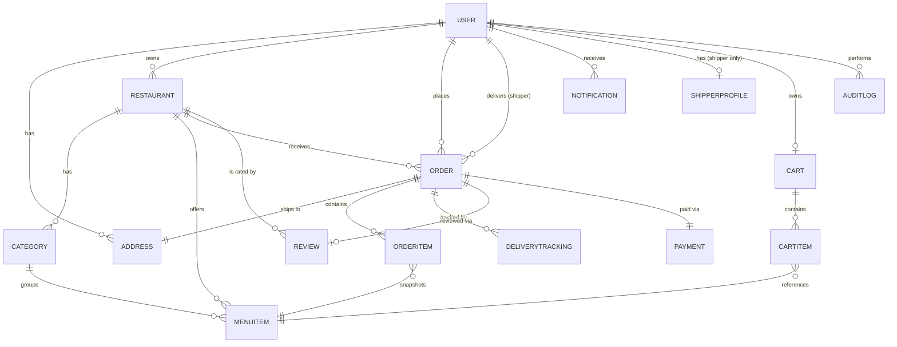
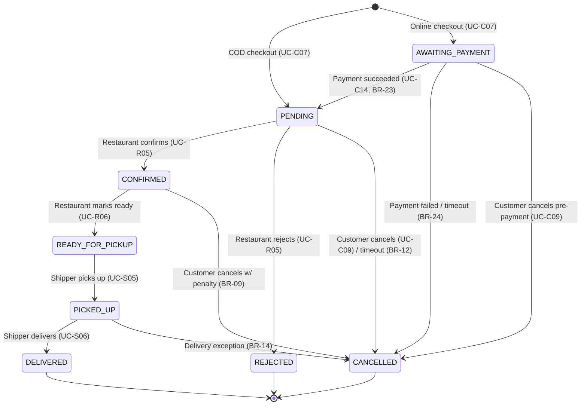

# Software Requirements Specification
## Foodya — Food Delivery Platform

| | |
|---|---|
| **Version** | 1.5-draft |
| **Status** | In progress |
| **Architecture** | Modular monolith (Spring Boot) |

### Revision History

| Version | Changes |
|---|---|
| 1.0 | Initial specification. |
| 1.1-draft | Normative rewrite; module responsibility and UC traceability added (§3.3). |
| 1.2-draft | Implementation status and priority added to the UC index (§4.1); BR-34, BR-35 added; UC-R01 respecified (owner role granted on approval); risks added (§2.6); package structure aligned with the codebase after removal of the `admin` and `merchant` packages; §7.2 register constraint documented. Pending: auth session rework (BR-03, BR-04, UC-C02, UC-C13). |
| 1.3-draft | §3.1/§3.2 updated: each module's internal layout changed from `controller/service/repository/model/mapper/dto` to `api/application/domain/persistence` (mapper folded into `api/dto/`). No change to module boundaries, ownership, or the role-oriented-modules prohibition. |
| 1.4-draft | Consolidated with the older, out-of-sync `FOODYA_SRS.md` (this file replaces it — that revision predated the 1.2/1.3 updates and had drifted). §3.1/§3.2/§3.3 updated: `shared` → `common`; `auth` + `user` merged into `identity` (both mutate the same `User` aggregate, so keeping them separate only produced a module-boundary violation in practice); `restaurant` → `catalog`; `order` → `ordering`. The role-oriented-modules prohibition (§3.1) is now enforced by an ArchUnit test, not just documented. |
| 1.5-draft | Corrected drift found against the actual codebase: UC-C06 was wrongly marked Implemented (no Address entity/endpoints exist — §4.1); UC-C01/§10.3 specified error codes (`AUTH_EMAIL_TAKEN`/`AUTH_USERNAME_TAKEN`) that don't exist in code, replaced with the actual `DUPLICATE_RESOURCE`; BR-02 corrected from "10 req/min login" to the real per-15-minute limits across all four rate-limited auth endpoints; §7.2/NFR-02 now document the HttpOnly-cookie + CSRF delivery of the refresh token to web clients, previously undocumented; UC-R01 now calls out the `catalog`→`identity` role-grant as a module-boundary case requiring the same facade pattern as §3.1, not a direct `User` write; added A4 documenting the single-valued `User.role` limitation (no multi-role accounts). |

---

## Table of Contents

1. [Introduction](#1-introduction)
2. [Overall Description](#2-overall-description)
3. [System Architecture](#3-system-architecture)
4. [Functional Requirements](#4-functional-requirements)
5. [Business Rules](#5-business-rules)
6. [Domain Model](#6-domain-model)
7. [API Specification](#7-api-specification)
8. [Order Status State Machine](#8-order-status-state-machine)
9. [Notifications & Real-Time Updates](#9-notifications--real-time-updates)
10. [Error Handling](#10-error-handling)
11. [Non-Functional Requirements](#11-non-functional-requirements)
12. [Phase 2: Recommendation](#12-phase-2-recommendation)
13. [Out of Scope](#13-out-of-scope)
14. [Glossary](#14-glossary)

---

## 1. Introduction

### 1.1 Purpose
This document specifies the functional and non-functional requirements of **Foodya**, a food-delivery platform connecting customers, restaurants, and shippers. It is the authoritative reference for design, implementation, and verification of the backend system.

### 1.2 Scope
This specification covers backend behavior, the domain model, API contracts, and quality attributes, including the backend contract for online payment (webhook handling and payment-driven state transitions). Frontend specifics and infrastructure/DevOps are addressed only where they constrain backend design.

**In scope (MVP):**
- Customer ordering flow: browse → cart → order → track → review
- Restaurant management: menu CRUD, order acceptance and preparation
- Shipper delivery flow: accept job → pick up → deliver
- Platform operations: approvals, moderation, oversight (Admin)
- Payment: Cash on Delivery (COD) and online payment (VNPay, Momo) behind a `PaymentProvider` interface

**Out of scope (MVP):** see §13.

### 1.3 Definitions & Acronyms

| Term | Meaning |
|---|---|
| SRS | Software Requirements Specification |
| BR | Business Rule |
| UC | Use Case |
| COD | Cash on Delivery |
| JWT | JSON Web Token |
| DTO | Data Transfer Object |
| NFR | Non-Functional Requirement |
| SSE | Server-Sent Events |

### 1.4 Conventions
- Requirement statements use **shall** (mandatory) and **should** (recommended).
- Business rules are numbered `BR-nn`; use cases `UC-<actor><nn>`; non-functional requirements `NFR-nn`; risks `R-nn`.
- **Implementation status** (§4.1): `Implemented` — built and consistent with this specification; `Divergent` — built but deviating from this specification, alignment required; `Planned` — specified, not yet built.
- **Priority** (§4.1) uses MoSCoW: `M` (Must), `S` (Should), `C` (Could).
- All monetary values are expressed in the smallest currency unit (BR-08).

---

## 2. Overall Description

### 2.1 Product Perspective
Foodya is a standalone three-sided marketplace (Customer / Restaurant / Shipper) with platform-operation capabilities for Admins, implemented as a single Spring Boot backend exposing a REST API to web and mobile clients.

### 2.2 Actors

| Actor | Description | Primary Goals |
|---|---|---|
| **Customer** | End user ordering food | Find food, order, track delivery |
| **Restaurant Owner** | Manages a restaurant storefront | Manage menu, fulfill orders |
| **Shipper** | Delivers orders | Find jobs, deliver, earn income |
| **Admin** | Platform operator | Approve/moderate accounts, resolve disputes |
| **Guest** | Unauthenticated visitor | Browse restaurants and menus |

### 2.3 Operating Environment

| Layer | Technology |
|---|---|
| Backend | Java 21, Spring Boot 3, single deployable JAR |
| Database | PostgreSQL |
| Auth | JWT (access + refresh token) |
| Migrations | Flyway/Liquibase; `ddl-auto: update` shall not be used in production |
| Payment | COD; online via `PaymentProvider` interface (VNPay, Momo adapters) |

### 2.4 Assumptions & Dependencies
- **A1** — Single-region deployment; no multi-region or multi-currency requirement in MVP.
- **A2** — Restaurants and shippers are onboarded with Admin approval; onboarding is not fully self-service.
- **A3** — Delivery fee derives from road distance obtained from a mapping provider, with a straight-line estimate as fallback (BR-19). No in-house routing engine is built.
- **A4** — `User.role` is single-valued, not a set of permissions. Consequently, a Customer who is granted `RESTAURANT_OWNER` (BR-35) or `SHIPPER` no longer authenticates as `CUSTOMER` and loses Customer-only capabilities (e.g. placing orders) until/unless a role change reverses this. Multi-role accounts (e.g. a restaurant owner who also orders as a customer) are explicitly not supported in the MVP; this is a deliberate scope limitation of the current `User` model, not an oversight.
- **D1** — The system depends on a third-party mapping provider for geocoding and road-distance lookup, accessed through a single internal interface.
- **D2** — The system depends on external payment providers (VNPay, Momo) for the ONLINE payment method, accessed through the `PaymentProvider` interface with one adapter per provider. COD has no external dependency.

### 2.5 Constraints
- **C1** — Two payment methods are supported: COD and ONLINE. Online payment depends on provider webhooks and provider-side refunds. COD has no refund path, as no money is collected upfront.
- **C2** — The monolith shall remain horizontally scalable at the process level: stateless API instances behind a load balancer.
- **C3** — All monetary values shall be stored as integers in the smallest currency unit (BR-08).

### 2.6 Risks

| ID | Risk | Mitigation |
|---|---|---|
| R-01 | The shipper approval gate (BR-17, BR-32) is not yet implemented: a self-registered shipper account is currently active immediately. Enabling `/shipper/**` routes before the gate exists would bypass Admin approval entirely. | `/shipper/**` routes shall remain disabled until ShipperProfile creation and the `SHIPPER_NOT_APPROVED` check are implemented and tested. |
| R-02 | The current build authenticates by username while this specification mandates email (UC-C02). Client integrations built against current behavior will break at alignment. | Alignment is scheduled within the auth rework; the login contract in §7.2 is the target contract. |
| R-03 | Online payment depends on provider webhook delivery. A missed webhook without the timeout sweep (BR-24) would strand orders in `AWAITING_PAYMENT`. | The sweep is part of the payment module's must-have scope, not an optional hardening step. |
| R-04 | Mapping-provider outage degrades fee accuracy (straight-line fallback, BR-19). | Fallback orders are flagged via `distance_source = FALLBACK` for later review. |

---

## 3. System Architecture

### 3.1 Architecture Style
Package-by-feature modular monolith. Each feature module owns four packages — `api` (controllers + `dto/` request/response contracts, mappers folded into `api/dto/`), `application` (`XxxService` for commands, `XxxQueryService` for queries, orchestration), `domain` (entities owned by the module + domain events under `domain/event/`), and `persistence` (repositories, JPA/Redis adapters). Request processing follows:

```
Request → api (REST, validation)
        → application (business logic, transactions)
        → persistence (Spring Data JPA)
        → PostgreSQL
```

**Module boundary rule.** A module may invoke another module's `application` facade only. Direct references to another module's `persistence` or `domain` packages are prohibited. This is enforced by an ArchUnit test (`ArchitectureTest`, one rule per module owning a `persistence` package) that fails the build on violation — not documentation-only. External SDKs (payment, mapping) shall be accessed only through their internal interface (`PaymentProvider`, mapping-provider interface); business logic shall not reference provider SDKs directly.

**Role-oriented modules are prohibited.** Modules are delimited by owned data and behavior, not by consuming actor. Actor-specific endpoints reside in the module that owns the underlying domain, split into audience subfolders under that module's `api/` (e.g. `catalog/api/{customer,merchant,admin}/`) rather than as separate top-level packages.

**Modules are delimited by owned aggregate, not by feature name.** `auth` and `user` were originally separate modules, but both mutated the same `User` aggregate — `user`'s service ended up reaching into `auth`'s repository directly to do it, which is exactly the module-boundary violation §3.1 prohibits. They are merged into a single `identity` module for this reason: a module boundary should track aggregate ownership, and splitting a module along lines that don't match that just relocates the violation instead of removing it.

### 3.2 Package Structure

```
com.foodya.backend
├── common/           # cross-cutting only, not the api/application/domain/persistence
│                     # layout: response envelope, exceptions, security filter chain,
│                     # trace-id filter, validation utils, OpenAPI config, Redis config
├── identity/         # credentials, tokens, sessions, user profile, delivery addresses,
│                     # user moderation — auth + user merged (see §3.1); owns the User
│                     # aggregate exclusively
├── catalog/          # restaurant profile, categories, menu items,
│                     # restaurant approval, owner dashboard
├── cart/             # (scaffold — Planned)
├── ordering/         # order lifecycle, state machine, restaurant-side
│                     # order management, platform analytics
├── payment/          # (scaffold — Planned) payment records, webhook handling
│   ├── api/ application/ domain/ persistence/
│   └── provider/     # PaymentProvider interface + VNPay/Momo adapters
│                     # (sits alongside the four standard packages — external-SDK
│                     # adapters are not application-layer orchestration)
├── delivery/         # (scaffold — Planned) shipper profile, jobs, tracking
├── review/           # (scaffold — Planned)
├── notification/     # (scaffold — Planned)
├── audit/            # (Planned, not yet scaffolded) append-only AuditLog for
│                     # moderation actions — created when a module first needs it,
│                     # not ahead of time
└── FoodyaApplication.java
```

Every module above (except `common`, which is organized by cross-cutting concern, not by feature) follows the four-package layout from §3.1: `api/`, `application/`, `domain/`, `persistence/`. Modules with more than one calling audience further split `api/` into `api/{customer,merchant,admin}/`.

The former `admin` and `merchant` packages are removed. Their endpoints are hosted by the owning domain modules per §3.1, inside that module's `api/`; public URL paths are unchanged (§7.5–§7.7).

### 3.3 Module Responsibilities & Use-Case Traceability

| Module | Owns | Primary Use Cases |
|---|---|---|
| identity | Credentials, token issuance/refresh/revocation, security filter chain, user profile, delivery addresses, user moderation (ban/unban) | UC-C01, UC-C02, UC-C06, UC-C12, UC-C13, UC-A01; account creation in UC-S01 |
| catalog | Restaurant profile, categories, menu items; restaurant approval; owner dashboard | UC-C03, UC-C04, UC-R01–UC-R03, UC-R07, UC-A02 |
| cart | Cart, cart items | UC-C05 |
| ordering | Order lifecycle, state machine, order history; restaurant-side order management; platform analytics | UC-C07–UC-C09, UC-C11, UC-R04–UC-R06, UC-A04, UC-A06 |
| payment | Payment records, provider adapters, webhook processing | UC-C14 |
| delivery | ShipperProfile, shipper approval, job assignment, location tracking, earnings | UC-S01–UC-S07, UC-A03 |
| review | Reviews, rating aggregation | UC-C10 |
| notification | Notification records, SSE delivery | §9 |
| audit | Append-only AuditLog written by moderation flows (BR-20) | supports UC-A01–UC-A03, UC-A06 |
| common | Cross-cutting concerns only; no business entities or logic | — |

### 3.4 Future Extraction Path
Module boundaries and the service-only call rule preserve the option of extracting a module into a separate deployable if an independent scaling need arises. No extraction is planned in the current scope.

---

## 4. Functional Requirements

### 4.1 Use Case Index

| UC | Title | Priority | Status |
|---|---|---|---|
| UC-C01 | Register | M | Implemented |
| UC-C02 | Login | M | Divergent — authenticates by username; email mandated (R-02) |
| UC-C03 | Browse / search restaurants | M | Implemented |
| UC-C04 | View restaurant menu | M | Implemented |
| UC-C05 | Manage cart | M | Planned |
| UC-C06 | Manage delivery addresses | M | Planned — no Address entity/endpoints exist yet; `identity` currently only covers profile fields (UC-C12) |
| UC-C07 | Checkout / place order | M | Planned |
| UC-C08 | Track order | S | Planned |
| UC-C09 | Cancel order | M | Planned |
| UC-C10 | Rate & review order | S | Planned |
| UC-C11 | View order history | S | Planned |
| UC-C12 | Manage profile | M | Implemented |
| UC-C13 | Refresh token / logout | M | Divergent — no rotation; rework pending (BR-04) |
| UC-C14 | Confirm online payment (webhook) | M | Planned |
| UC-R01 | Apply to open a restaurant | M | Divergent — no role-grant path in current build (BR-35) |
| UC-R02 | Manage menu categories | M | Implemented |
| UC-R03 | Manage menu items | M | Implemented |
| UC-R04 | View incoming orders | M | Planned |
| UC-R05 | Confirm / reject order | M | Planned |
| UC-R06 | Update preparation status | M | Planned |
| UC-R07 | View restaurant dashboard | S | Planned |
| UC-S01 | Register as shipper | M | Divergent — ShipperProfile and approval gate missing (R-01, BR-32) |
| UC-S02 | View available delivery jobs | M | Planned |
| UC-S03 | Accept delivery job | M | Planned |
| UC-S04 | Update location | S | Planned |
| UC-S05 | Mark picked up | M | Planned |
| UC-S06 | Mark delivered | M | Planned |
| UC-S07 | View earnings | C | Planned |
| UC-A01 | Manage users | M | Implemented — ban/unban only |
| UC-A02 | Approve/reject restaurant | M | Planned |
| UC-A03 | Approve/reject shipper | M | Planned |
| UC-A04 | Platform analytics | C | Planned |
| UC-A05 | View platform configuration | C | Planned |
| UC-A06 | Handle disputes | S | Planned |

### 4.2 Customer Use Cases

**UC-C01 — Register**
- Preconditions: Email not registered.
- Main flow: Customer submits email, password, full name, phone, and role. The system shall accept only self-registerable roles (BR-34), validate input, create a User (`status=ACTIVE` for CUSTOMER), and return a JWT pair.
- Alternatives: (1a) Username, email, or phone already registered → 409 `DUPLICATE_RESOURCE` (one generic code; the message text distinguishes which field conflicted — there is no per-field error code). (1b) Non-self-registerable role → 403 `FORBIDDEN` (BR-34).
- Postconditions: User created and authenticated.

**UC-C02 — Login**
- The authentication identifier shall be **email**. `username` is a display field and shall not be used for authentication.
- Main flow: Customer submits email and password. The system shall verify credentials and issue an access/refresh token pair.
- Alternatives: (1a) Invalid credentials → 401 `AUTH_INVALID_CREDENTIALS`, rate-limited per BR-02. (1b) Banned account → 403 `AUTH_ACCOUNT_BANNED`. (1c) Unknown email → identical 401 response to (1a); the system shall not disclose whether an email exists.

**UC-C03 — Browse / Search Restaurants**
- Main flow: Guest or Customer lists restaurants with optional filters (name, category, location radius). Results shall be paginated and sortable by distance or rating.
- Alternatives: (1a) No match → 200 with empty list.

**UC-C04 — View Restaurant Menu**
- Main flow: The system shall return the restaurant's categories and items with availability flags.
- Alternatives: (1a) Restaurant closed or suspended → menu remains viewable; ordering is disabled (UC-C07 3a).

**UC-C05 — Manage Cart**
- Main flow: Customer adds, updates, or removes items. A cart shall be scoped to one restaurant (BR-05).
- Alternatives: (1a) Item from a different restaurant → the system shall require clearing the cart first. (1b) Item becomes unavailable while in cart → flagged at checkout; not silently removed.

**UC-C06 — Manage Delivery Addresses**
- Main flow: Customer creates, updates, deletes addresses and designates one default.
- Alternatives: (1a) Deleting the only address referenced by a non-terminal order → blocked, 422 `ADDRESS_LAST_ONE`.

**UC-C07 — Checkout / Place Order**
- Preconditions: Non-empty cart; at least one saved address.
- Main flow:
  1. Customer selects address and payment method (COD, or ONLINE with provider VNPAY/MOMO).
  2. The system shall validate that the restaurant is orderable and all items available (BR-06).
  3. The system shall obtain road distance (fallback per BR-19) and compute shipping fee (BR-07); total = subtotal + shipping fee.
  4. Customer confirms.
  5. The system shall create the Order, OrderItem snapshots (BR-18), and one Payment record (BR-28), then clear the cart.
     - COD: Order status `PENDING`; restaurant notified immediately.
     - ONLINE: Order status `AWAITING_PAYMENT` (BR-23); the system shall request a payment session from the selected provider and return its redirect URL. The restaurant shall not be notified at this point.
  6. The system returns order id, status, and (ONLINE) the redirect URL.
- Alternatives: (3a) Restaurant not orderable → 422 `RESTAURANT_CLOSED` / `RESTAURANT_SUSPENDED`; no order created. (3b) Unavailable items → 422 `ITEMS_UNAVAILABLE` with the affected items.
- Postconditions: Order in `PENDING` (COD) or `AWAITING_PAYMENT` (ONLINE).

**UC-C08 — Track Order**
- Main flow: Customer subscribes (SSE) or polls order status; once a shipper is assigned, the shipper's last known location is included.
- Alternatives: (1a) Terminal order → final state only; no live location.

**UC-C09 — Cancel Order**
- Main flow: Cancellation is permitted while status is `AWAITING_PAYMENT`, `PENDING`, or `CONFIRMED`.
- Alternatives: (0a) `AWAITING_PAYMENT` → cancel immediately; nothing to refund. (1a) `PENDING` → free cancellation. (1b) `CONFIRMED` → allowed; cancellation count incremented (BR-09); refund issued if paid online (BR-25). (1c) `READY_FOR_PICKUP` or later → blocked, 422 `ORDER_NOT_CANCELLABLE`.

**UC-C10 — Rate & Review Order**
- Preconditions: Order status `DELIVERED`.
- Main flow: Customer submits rating (1–5) and optional comment; the system shall recalculate the restaurant's aggregate rating (BR-16).
- Alternatives: (1a) Second review for the same order → 422 `REVIEW_ALREADY_EXISTS` (BR-15).

**UC-C11 — View Order History**
- Main flow: Paginated list of the customer's past orders with status and totals.

**UC-C12 — Manage Profile**
- Main flow: Update name, phone, avatar. Password change is specified under auth (§7.2), not this use case.

**UC-C13 — Refresh Token / Logout**
- Refresh: Client submits refresh token; the system shall validate it and issue a new access token. *(Pending rework: token rotation and reuse detection.)*
- Logout: Client submits refresh token; the system shall revoke it server-side (BR-03). Subsequent use returns 401 `AUTH_TOKEN_REVOKED`.
- Alternatives: (1a) Expired or unknown refresh token → 401 `AUTH_TOKEN_REVOKED`.

**UC-C14 — Confirm Online Payment (webhook-driven)**
- Preconditions: Order in `AWAITING_PAYMENT`.
- Main flow:
  1. Customer completes payment on the provider's hosted checkout page (BR-27).
  2. The provider delivers an asynchronous webhook to the payment callback endpoint.
  3. The matching adapter shall verify the webhook signature (BR-26) and translate it into the internal normalized payment event keyed by `provider_txn_ref`.
  4. On success: Payment status `SUCCESS`; Order `AWAITING_PAYMENT → PENDING` (BR-23); restaurant notified.
  5. The system responds 200 to the provider.
- Alternatives: (3a) Invalid signature → 400, logged as security event, no state change. (3b) Duplicate `provider_txn_ref` → 200 without reprocessing (BR-26). (4a) Provider reports failure → Payment `FAILED`; Order → `CANCELLED` (BR-24). (4b) No webhook within 15 minutes → scheduled sweep cancels the order with reason `PAYMENT_TIMEOUT` (BR-24).
- Postconditions: Order `PENDING` or `CANCELLED`; Payment reflects the final state.

### 4.3 Restaurant Owner Use Cases

**UC-R01 — Apply to Open a Restaurant**
- Preconditions: Authenticated user.
- Main flow: The applicant submits a restaurant profile (name, address, phone, opening hours). The system shall create the Restaurant with status `PENDING` awaiting Admin review (UC-A02). Upon approval, the system shall grant the applicant the `RESTAURANT_OWNER` role (BR-35) and notify them.
- Alternatives: (1a) Missing required fields → 400 `VALIDATION_ERROR`. (2a) Application rejected → applicant notified with reason; role unchanged.
- Postconditions: Restaurant `PENDING`; on approval, restaurant `APPROVED` and applicant holds `RESTAURANT_OWNER`.
- **Module boundary note.** Granting the role mutates `User`, which `identity` owns exclusively (§3.1). The `catalog` approval flow (UC-A02) shall perform the grant by calling an `identity` application-layer facade (the same pattern as `AuthService.findByUsername` used by `ordering`) — never by writing to the `User` row from within `catalog`. This is the same class of violation the `auth`/`user` merge (§3.1) removed; a new cross-module case must not reintroduce it.

**UC-R02 — Manage Menu Categories**
- Main flow: CRUD categories scoped to the owner's restaurant; reorder via `display_order`.

**UC-R03 — Manage Menu Items**
- Main flow: CRUD menu items (name, price, description, image, category, availability).
- Alternatives: (1a) Deleting an item referenced by historical OrderItems → soft delete only (BR-10).

**UC-R04 — View Incoming Orders**
- Main flow: Owner views orders in `PENDING`, newest first, with notification. Orders in `AWAITING_PAYMENT` shall not be visible (BR-23).

**UC-R05 — Confirm / Reject Order**
- Main flow: Owner confirms (`PENDING → CONFIRMED`) or rejects (`PENDING → REJECTED`, with reason) within the response window (BR-11).
- Alternatives: (1a) No response within window → auto-cancel per BR-12.

**UC-R06 — Update Preparation Status**
- Main flow: Owner marks `CONFIRMED → READY_FOR_PICKUP`; nearby shippers notified (§9).

**UC-R07 — View Restaurant Dashboard**
- Main flow: Revenue summary, order count, and rating trend over a date range.

### 4.4 Shipper Use Cases

**UC-S01 — Register as Shipper**
- Main flow: Applicant submits profile and vehicle information. The system shall create the User (`role=SHIPPER`) and ShipperProfile (`status=PENDING_APPROVAL`) atomically (BR-32), pending Admin approval (UC-A03). Delivery capability shall remain disabled until approval (BR-17).
- Alternatives: (1a) Missing vehicle information → 400 `VALIDATION_ERROR`.

**UC-S02 — View Available Delivery Jobs**
- Preconditions: `ShipperProfile.status = APPROVED` (BR-17); otherwise 422 `SHIPPER_NOT_APPROVED`.
- Main flow: List unassigned orders in `READY_FOR_PICKUP` near the shipper's location.

**UC-S03 — Accept Delivery Job**
- Main flow: Shipper accepts; `Order.shipper_id` is set; status remains `READY_FOR_PICKUP`.
- Alternatives: (1a) Concurrent accept → optimistic locking permits exactly one winner; others receive 409 `JOB_ALREADY_TAKEN` (BR-13).

**UC-S04 — Update Location**
- Main flow: Shipper client periodically posts lat/lng during an active delivery; stored as DeliveryTracking rows and streamed to the customer (§9).

**UC-S05 — Mark Picked Up**
- Main flow: `READY_FOR_PICKUP → PICKED_UP`; customer notified.

**UC-S06 — Mark Delivered**
- Main flow: `PICKED_UP → DELIVERED`; customer notified; review window opens. For COD, Payment status shall flip `PENDING → SUCCESS` at this moment (BR-28). Online payments are unaffected by delivery events.
- Alternatives: (1a) Customer unreachable or refuses → delivery exception (BR-14); order `CANCELLED` with structured reason; refund if paid online (BR-25); Admin notified.

**UC-S07 — View Earnings**
- Main flow: Completed deliveries with per-order fee and date-range totals.

### 4.5 Admin Use Cases

**UC-A01 — Manage Users**
- Main flow: Search/filter users; ban/unban with reason; action recorded in AuditLog (BR-20).

**UC-A02 — Approve/Reject Restaurant**
- Main flow: Review pending restaurant → approve (`PENDING → APPROVED`; applicant granted `RESTAURANT_OWNER` per BR-35) or reject with reason; applicant notified; recorded in AuditLog (BR-20).

**UC-A03 — Approve/Reject Shipper**
- Main flow: Review pending ShipperProfile → approve or reject with reason (BR-32); applicant notified; recorded in AuditLog (BR-20).

**UC-A04 — Platform Analytics**
- Main flow: Aggregate order volume, GMV, active restaurants/shippers over time.

**UC-A05 — View Platform Configuration**
- Main flow: Admin views effective configuration values (base shipping fee, per-km rate, response window, cancellation threshold). Values reside in application configuration overridable per environment; they are not runtime-editable.

**UC-A06 — Handle Disputes**
- Main flow: Review flagged orders/reviews; available actions: trigger provider refund for online-paid orders (BR-25), remove review, warn or ban account. Every action recorded in AuditLog (BR-20). COD orders have no refund action (C1).

---

## 5. Business Rules

| ID | Rule |
|---|---|
| BR-01 | A User shall have exactly one role. Roles are never self-changeable; role grants occur only through system-defined flows (BR-34, BR-35). |
| BR-02 | Auth endpoints shall be rate-limited per IP over a 15-minute window: login 10, register 5, refresh 30, change-password 5. Exceeding the limit returns 429 `RATE_LIMIT_EXCEEDED`. |
| BR-03 | Refresh tokens shall be stored or denylisted server-side so that logout takes effect immediately. |
| BR-04 | Access token TTL = 24 h; refresh token TTL = 30 days. *(Pending rework: shortened access TTL with rotating refresh tokens.)* |
| BR-05 | A Cart shall belong to exactly one Restaurant at a time; adding an item from another restaurant requires clearing the cart. |
| BR-06 | An order shall be accepted only if the restaurant is `APPROVED`, within opening hours, and all cart items have `is_available = true`. |
| BR-07 | Shipping fee = base fee + (road_distance_km × per_km_rate). Base fee and rate are configuration values. |
| BR-08 | All monetary fields shall be stored as integers in the smallest currency unit; no floating-point arithmetic on money. |
| BR-09 | A customer cancelling a `CONFIRMED` order more than N times in a rolling 30-day window (configured, default 3) shall be flagged for Admin review. |
| BR-10 | Menu items referenced by any historical OrderItem shall never be hard-deleted; deletion is a soft-delete flag. |
| BR-11 | Restaurant response window for `PENDING` orders = 5 minutes (configured). |
| BR-12 | On response-window expiry, the order shall be auto-cancelled with reason `RESTAURANT_TIMEOUT`; customer notified. |
| BR-13 | Order-to-shipper assignment shall use optimistic locking (version column) on Order; concurrent accepts fail for all but the first. |
| BR-14 | A delivery exception (unreachable, wrong address, refused) shall end the order as `CANCELLED` with a structured reason code. |
| BR-15 | A Review shall be created at most once per Order, and only when the Order is `DELIVERED`. |
| BR-16 | `Restaurant.rating_avg` shall be recalculated as the arithmetic mean on every new Review. |
| BR-17 | A Restaurant or Shipper shall be `APPROVED` by Admin before becoming active/visible. |
| BR-18 | OrderItem shall snapshot item name and price at order time; later menu changes never alter historical orders. |
| BR-19 | Road distance shall be fetched once at checkout and stored on the Order (`distance_km`, `distance_source`); on provider failure, a straight-line estimate is used and `distance_source = FALLBACK`. |
| BR-20 | Every Admin moderation action shall write an append-only AuditLog row (actor, action, target, reason, timestamp). AuditLog rows shall never be updated or deleted. |
| BR-21 | *(Reserved — merged into BR-17.)* |
| BR-22 | Every coordinate column shall carry database CHECK constraints: latitude ∈ [−90, 90], longitude ∈ [−180, 180]. |
| BR-23 | An online-paid order shall start in `AWAITING_PAYMENT` and remain invisible to the restaurant until payment success moves it to `PENDING`. A COD order starts at `PENDING`. |
| BR-24 | If an online payment fails or no confirmation arrives within 15 minutes, the order shall move to `CANCELLED` with reason `PAYMENT_FAILED` or `PAYMENT_TIMEOUT`. The cart is not restored. |
| BR-25 | For an online-paid order cancelled before `PICKED_UP`, the system shall issue an asynchronous best-effort refund via the same provider. COD has no refund path. |
| BR-26 | Every payment webhook shall be signature-verified before processing and processed idempotently keyed by `provider_txn_ref`; duplicate deliveries shall never double-apply a state change. |
| BR-27 | The system shall never store raw card or wallet credentials; every online payment redirects to the provider's hosted checkout page. |
| BR-28 | Every Order shall have exactly one Payment row. COD: Payment starts `PENDING` and flips to `SUCCESS` on `DELIVERED` (UC-S06). ONLINE: Payment status is driven solely by provider webhooks. |
| BR-29 | No payment retry is permitted on the same Order after failure or timeout (BR-24); the order is `CANCELLED` and the customer places a new order. |
| BR-30 | `User.status` ∈ {`ACTIVE` (default), `BANNED`}. Deactivation shall use `BANNED`, never row deletion (§6.4). |
| BR-31 | `Restaurant.status` ∈ {`PENDING`, `APPROVED`, `REJECTED`, `SUSPENDED`}. Only `APPROVED` restaurants appear in public listings. |
| BR-32 | A ShipperProfile row (vehicle data; status `PENDING_APPROVAL` → `APPROVED`/`REJECTED`) shall be created atomically with the User at shipper registration. Delivery capability requires `ShipperProfile.status = APPROVED`. |
| BR-33 | Every HTTP request shall receive a UUID v4 `traceId` generated by a servlet filter, stored in the logging MDC, and returned in every `ApiResponse`. Business code shall not generate or set `traceId`. |
| BR-34 | Only `CUSTOMER` and `SHIPPER` are self-registerable via `/auth/register`. A registration request carrying any other role shall be rejected with 403 `FORBIDDEN`. |
| BR-35 | The `RESTAURANT_OWNER` role shall be granted by the system upon Admin approval of the user's restaurant application (UC-R01, UC-A02). It shall never be self-selectable at registration or self-assignable afterwards. |

---

## 6. Domain Model

### 6.1 Entity Summary

| Entity | Key Attributes |
|---|---|
| **User** | id, email, username, password_hash, full_name, phone, role, status (BR-30), created_at |
| **ShipperProfile** | id, user_id (FK → User, unique), vehicle_type, license_plate, status (BR-32), rejection_reason, created_at |
| **Address** | id, user_id, label, recipient_name, phone, street, ward, district, city, latitude, longitude, is_default |
| **Restaurant** | id, owner_id, name, description, address, latitude, longitude, phone, status (BR-31), opening_hours, rating_avg, created_at |
| **Category** | id, restaurant_id, name, display_order |
| **MenuItem** | id, restaurant_id, category_id, name, description, price (int, BR-08), image_url, is_available, is_deleted (BR-10), created_at |
| **Cart** | id, customer_id, restaurant_id, updated_at |
| **CartItem** | id, cart_id, menu_item_id, quantity, note |
| **Order** | id, customer_id, restaurant_id, shipper_id (nullable), delivery_address_id, status, subtotal, shipping_fee, distance_km, distance_source, total, version (BR-13), cancel_reason, created_at, confirmed_at, picked_up_at, delivered_at, cancelled_at |
| **OrderItem** | id, order_id, menu_item_id (FK for analytics, BR-18), item_name_snapshot, item_price_snapshot, quantity, subtotal |
| **DeliveryTracking** | id, order_id, shipper_id, latitude, longitude, recorded_at |
| **Review** | id, order_id, customer_id, restaurant_id, rating (1–5), comment, created_at |
| **Notification** | id, user_id, type, title, message, is_read, related_order_id (nullable), created_at |
| **AuditLog** | id, actor_user_id, action, target_type, target_id, reason, created_at |
| **Payment** | id, order_id, method (`COD`\|`ONLINE`), provider (`VNPAY`\|`MOMO`\|null), status (`PENDING`\|`SUCCESS`\|`FAILED`\|`REFUNDED`), provider_txn_ref, amount, paid_at, created_at |

`username` is unique but is not the authentication identifier (UC-C02).

### 6.2 Entity-Relationship Diagram



### 6.3 Relationship Notes
- Cart is one active checkout session per customer, scoped to one restaurant (BR-05).
- OrderItem display never follows the MenuItem FK for price; snapshots are authoritative (BR-18).
- `Order.shipper_id` is null until UC-S03.
- AuditLog targets are generic (`target_type` + `target_id`).
- Payment is mandatory 1:1 with Order (BR-28); `provider` is null for COD.
- ShipperProfile is 1:1 with User and created in the same transaction at shipper registration (BR-32).
- `MenuItem.category_id` is non-nullable with RESTRICT on category delete; the service layer requires reassignment or soft-deletion of items before category removal.

### 6.4 Data Integrity Constraints

**Foreign-key delete behavior:**

| Relationship | On Delete | Rationale |
|---|---|---|
| Address.user_id → User | RESTRICT | Deactivate via `User.status`, never delete. |
| MenuItem.category_id → Category | RESTRICT | No orphaned items; explicit reassignment first. |
| OrderItem.menu_item_id → MenuItem | RESTRICT | MenuItem is soft-deleted only (BR-10). |
| CartItem.cart_id → Cart | CASCADE | Cart deletion clears its items. |
| DeliveryTracking.order_id → Order | CASCADE | Tracking has no meaning without its order. |
| Notification.related_order_id → Order | SET NULL | Notification history survives order purge. |
| Payment.order_id → Order | RESTRICT | Financial records shall never disappear as a side effect. |

**Check constraints:**
- Coordinate bounds on every lat/lng column (BR-22).
- `rating BETWEEN 1 AND 5` on Review.
- `quantity > 0` on CartItem and OrderItem.
- Non-negative constraints on all monetary columns.
- `Payment.method IN ('COD','ONLINE')`; `provider` non-null iff `method = 'ONLINE'`.

---

## 7. API Specification

### 7.1 Conventions
- Base path: `/api/v1`.
- Authentication: `Authorization: Bearer <access_token>` on all endpoints except register, login, and public restaurant browsing.
- Request bodies are plain JSON. Every client-facing **response** is wrapped in the `ApiResponse` envelope (`@JsonInclude(NON_NULL)`):

```json
{
  "success": true,
  "message": "Human-readable string",
  "data": {},
  "meta": { "page": 0, "size": 10, "total": 100 },
  "code": "ERROR_CODE",
  "timestamp": "2026-06-22T10:15:00Z",
  "traceId": "uuid"
}
```

- `meta` appears only on paginated endpoints; `code` only on errors; `traceId` per BR-33.
- Controllers shall construct responses only through the `ApiResponse.success(...)` / `ApiResponse.error(...)` factory methods.
- Exception: the payment webhook endpoint (§7.4.1) returns a bare HTTP status, not the envelope.

### 7.2 Auth

```
POST /api/v1/auth/register
POST /api/v1/auth/login
POST /api/v1/auth/refresh
POST /api/v1/auth/logout
POST /api/v1/auth/change-password   (authenticated)
```

**POST /auth/register.** `role` accepts `CUSTOMER` or `SHIPPER` only (BR-34); any other value returns 403 `FORBIDDEN`. The published OpenAPI schema shall enumerate exactly these two values.

**POST /auth/login — 200**
```json
{
  "success": true,
  "message": "Login successful",
  "data": {
    "accessToken": "eyJ...",
    "refreshToken": "eyJ...",
    "expiresIn": 86400,
    "user": { "id": "uuid", "fullName": "Nguyen Van A", "role": "CUSTOMER" }
  },
  "timestamp": "2026-06-22T10:15:00Z",
  "traceId": "550e8400-e29b-41d4-a716-446655440000"
}
```

**POST /auth/login — 401**
```json
{
  "success": false,
  "message": "Invalid email or password",
  "code": "AUTH_INVALID_CREDENTIALS",
  "timestamp": "2026-06-22T10:15:00Z",
  "traceId": "550e8400-e29b-41d4-a716-446655440000"
}
```

Logout revokes the submitted refresh token server-side (BR-03); subsequent use returns 401 `AUTH_TOKEN_REVOKED`. Password change requires the current password.

**Web client delivery (HttpOnly cookie + CSRF).** For browser clients, the refresh token shall additionally be set as an HttpOnly, `SameSite` cookie on login/register/refresh; the `refreshToken` field in the response body exists for non-browser (mobile) clients and shall be ignored by web clients in favor of the cookie. Because the cookie is sent automatically by the browser, every state-changing request from a web client shall include a CSRF token (issued alongside the cookie and validated server-side); a missing or invalid CSRF token returns 403 `FORBIDDEN`.

### 7.3 Restaurant & Menu

```
# Public
GET  /api/v1/restaurants?lat=&lng=&radiusKm=&search=&cuisine=&minRating=&sortBy=&page=&size=
GET  /api/v1/restaurants/{id}
GET  /api/v1/restaurants/{id}/menu

# Restaurant application (any authenticated user — BR-35) / owner management
POST   /api/v1/restaurants                          (status=PENDING on creation)
PUT    /api/v1/restaurants/{id}                     (owner)
PATCH  /api/v1/restaurants/{id}/toggle-status       (owner)

# Categories (owner)
POST   /api/v1/restaurants/{id}/categories
PUT    /api/v1/restaurants/{id}/categories/{catId}
DELETE /api/v1/restaurants/{id}/categories/{catId}
PATCH  /api/v1/restaurants/{id}/categories/reorder

# Menu items (owner)
GET    /api/v1/restaurants/{id}/menu-items
POST   /api/v1/restaurants/{id}/menu-items
PUT    /api/v1/restaurants/{id}/menu-items/{itemId}
PATCH  /api/v1/restaurants/{id}/menu-items/{itemId}/toggle-availability
DELETE /api/v1/restaurants/{id}/menu-items/{itemId} (soft delete — BR-10)
```

**GET /restaurants — 200 (paginated)**
```json
{
  "success": true,
  "message": "Restaurants retrieved",
  "data": [ { "id": 5, "name": "Pho Hung", "ratingAvg": 4.6, "status": "APPROVED" } ],
  "meta": { "page": 0, "size": 20, "total": 134 },
  "timestamp": "2026-06-22T10:15:00Z",
  "traceId": "550e8400-e29b-41d4-a716-446655440000"
}
```

### 7.4 Cart & Orders

```
GET    /api/v1/cart
POST   /api/v1/cart/items
PATCH  /api/v1/cart/items/{id}
DELETE /api/v1/cart/items/{id}
POST   /api/v1/orders                     (checkout — COD or ONLINE)
GET    /api/v1/orders/{id}
GET    /api/v1/orders/{id}/payment        (payment-status poll; webhook fallback)
GET    /api/v1/orders                     (history, paginated)
PATCH  /api/v1/orders/{id}/cancel
```

**POST /orders — Request (ONLINE)**
```json
{ "addressId": 7, "paymentMethod": "ONLINE", "provider": "VNPAY", "note": "No coriander" }
```

**201 (ONLINE — awaiting payment)**
```json
{
  "success": true,
  "message": "Order created, awaiting payment",
  "data": {
    "id": 991,
    "status": "AWAITING_PAYMENT",
    "subtotal": 90000,
    "shippingFee": 15000,
    "total": 105000,
    "payment": {
      "method": "ONLINE", "provider": "VNPAY", "status": "PENDING",
      "redirectUrl": "https://provider.example/checkout/abc123"
    },
    "createdAt": "2026-06-22T10:15:00Z"
  },
  "timestamp": "2026-06-22T10:15:00Z",
  "traceId": "550e8400-e29b-41d4-a716-446655440000"
}
```

**422 (items unavailable)**
```json
{
  "success": false,
  "message": "Some items are no longer available",
  "data": [ { "menuItemId": 101, "name": "Pho Bo" } ],
  "code": "ITEMS_UNAVAILABLE",
  "timestamp": "2026-06-22T10:15:00Z",
  "traceId": "550e8400-e29b-41d4-a716-446655440000"
}
```

#### 7.4.1 Payment Webhook (internal contract)

```
POST /api/v1/payments/webhook/{provider}   (provider = vnpay | momo)
```

Each provider adapter shall verify the provider-specific signature and translate the raw webhook into one internal normalized event before any other component processes it:

```json
{ "providerTxnRef": "TXN-9F2A1", "orderId": 991, "result": "SUCCESS", "amount": 105000 }
```

Order and notification logic shall depend only on this normalized shape. The endpoint responds with a bare HTTP status (§7.1).

### 7.5 Restaurant-Side Order Management (hosted in `order`)

```
GET   /api/v1/restaurant/orders?status=PENDING
PATCH /api/v1/restaurant/orders/{id}/confirm
PATCH /api/v1/restaurant/orders/{id}/reject
PATCH /api/v1/restaurant/orders/{id}/ready
```

### 7.6 Shipper (hosted in `delivery`)

```
GET   /api/v1/shipper/jobs?lat=&lng=&radiusKm=
PATCH /api/v1/shipper/jobs/{orderId}/accept
PATCH /api/v1/shipper/orders/{id}/pickup
PATCH /api/v1/shipper/orders/{id}/deliver
POST  /api/v1/shipper/location
GET   /api/v1/shipper/earnings?from=&to=
```

All `/shipper/**` endpoints require `ShipperProfile.status = APPROVED` (BR-32); otherwise 422 `SHIPPER_NOT_APPROVED`. These routes shall remain disabled until that check is implemented (R-01).

**PATCH /shipper/jobs/{orderId}/accept — 409 (race lost)**
```json
{
  "success": false,
  "message": "This delivery was already accepted by another shipper",
  "code": "JOB_ALREADY_TAKEN",
  "timestamp": "2026-06-22T10:15:00Z",
  "traceId": "550e8400-e29b-41d4-a716-446655440000"
}
```

### 7.7 Platform Operations (ADMIN role; hosted in owning modules)

```
# user module
GET   /api/v1/admin/users?status=
PATCH /api/v1/admin/users/{id}/ban

# restaurant module (approval grants RESTAURANT_OWNER — BR-35)
GET   /api/v1/admin/restaurants?status=PENDING
PATCH /api/v1/admin/restaurants/{id}/approve
PATCH /api/v1/admin/restaurants/{id}/reject

# delivery module
GET   /api/v1/admin/shippers?status=PENDING
PATCH /api/v1/admin/shippers/{id}/approve

# order module
GET   /api/v1/admin/analytics/overview?from=&to=
```

### 7.8 Reviews & Notifications

```
POST  /api/v1/orders/{id}/review
GET   /api/v1/restaurants/{id}/reviews?page=&size=
GET   /api/v1/notifications?page=&size=
PATCH /api/v1/notifications/{id}/read
PATCH /api/v1/notifications/read-all
```

### 7.9 User Profile & Addresses

```
GET  /api/v1/users/me
PUT  /api/v1/users/me

GET    /api/v1/users/me/addresses
POST   /api/v1/users/me/addresses
GET    /api/v1/users/me/addresses/{id}
PUT    /api/v1/users/me/addresses/{id}
DELETE /api/v1/users/me/addresses/{id}
PATCH  /api/v1/users/me/addresses/{id}/set-default
```

- `DELETE /addresses/{id}` returns 422 `ADDRESS_LAST_ONE` when the address is the user's only one and is referenced by a non-terminal order (UC-C06).
- `set-default` atomically sets `is_default = true` on the target and `false` on all of the user's other addresses.

---

## 8. Order Status State Machine

### 8.1 State Diagram



### 8.2 Transition Table

| From | To | Trigger / Actor | Side Effects |
|---|---|---|---|
| — | PENDING | COD checkout (UC-C07) | Cart cleared; restaurant notified |
| — | AWAITING_PAYMENT | Online checkout (UC-C07) | Cart cleared; customer redirected; restaurant not notified |
| AWAITING_PAYMENT | PENDING | Payment success (UC-C14) | Restaurant notified — order becomes visible |
| AWAITING_PAYMENT | CANCELLED | Customer cancels pre-payment (UC-C09) | Nothing to refund; cart not restored (BR-29) |
| AWAITING_PAYMENT | CANCELLED | Payment failed / timeout (BR-24) | Customer notified; cart not restored (BR-29) |
| PENDING | CONFIRMED | Restaurant confirms (UC-R05) | Customer notified |
| PENDING | REJECTED | Restaurant rejects (UC-R05) | Customer notified with reason |
| PENDING | CANCELLED | Customer cancels (UC-C09) / timeout (BR-12) | No penalty |
| CONFIRMED | READY_FOR_PICKUP | Restaurant marks ready (UC-R06) | Nearby shippers notified |
| CONFIRMED | CANCELLED | Customer cancels (UC-C09) | Penalty count (BR-09); refund if online (BR-25) |
| READY_FOR_PICKUP | PICKED_UP | Shipper picks up (UC-S05) | Live tracking begins |
| PICKED_UP | DELIVERED | Shipper delivers (UC-S06) | Review opens; COD payment flips to SUCCESS (BR-28) |
| PICKED_UP | CANCELLED | Delivery exception (BR-14) | Admin notified; refund if online (BR-25) |

**Invariants.** `DELIVERED`, `REJECTED`, and `CANCELLED` are terminal; no further transitions are permitted. All status changes shall pass through a single service-layer transition validator that rejects any transition not in the table above with 422 `INVALID_ORDER_TRANSITION`; no code path, including Admin actions, may bypass it. `AWAITING_PAYMENT` is never visible to the restaurant (BR-23).

---

## 9. Notifications & Real-Time Updates

| Event | Mechanism | Recipient |
|---|---|---|
| Online payment succeeded | Push/SSE | Customer + Restaurant Owner |
| Online payment failed / timed out | Push/SSE | Customer |
| New order (COD, or online after payment) | Push/SSE | Restaurant Owner |
| Order confirmed/rejected | Push/SSE | Customer |
| Order ready for pickup | Push/SSE broadcast | Nearby shipper pool |
| Order picked up / delivered | Push/SSE | Customer |
| Shipper location update | SSE stream | Customer (active delivery only) |
| Approval result (restaurant/shipper, incl. role grant) | Push | Applicant |

Server→client pushes shall use SSE. Shipper location upload is a periodic `POST /shipper/location`; a bidirectional WebSocket channel is not used in MVP.

---

## 10. Error Handling

### 10.1 Approach
A single global exception handler (`@RestControllerAdvice`) shall map typed domain exceptions to `ApiResponse.error(...)` responses. Feature services shall throw typed exceptions and shall not construct response bodies.

### 10.2 Error Response Format
```json
{
  "success": false,
  "message": "Validation failed",
  "data": { "email": "Email must be valid", "phone": "Phone is required" },
  "code": "VALIDATION_ERROR",
  "timestamp": "2026-06-22T10:15:00Z",
  "traceId": "550e8400-e29b-41d4-a716-446655440000"
}
```
`data` and `code` are optional and independent; `data` carries structured detail when present.

### 10.3 Error Code Table

| HTTP | Code | Used In |
|---|---|---|
| 400 | VALIDATION_ERROR | Malformed/invalid request body |
| 400 | WEBHOOK_INVALID_SIGNATURE | UC-C14 (BR-26) |
| 401 | AUTH_INVALID_CREDENTIALS | UC-C02 (wrong password or unknown email) |
| 401 | AUTH_TOKEN_REVOKED | UC-C13; expired or revoked refresh token |
| 402 | PAYMENT_FAILED | UC-C14 |
| 403 | AUTH_ACCOUNT_BANNED | UC-C02 (BR-30) |
| 403 | FORBIDDEN | Authorization failure; non-self-registerable role (BR-34) |
| 404 | RESOURCE_NOT_FOUND | Generic entity lookup |
| 409 | JOB_ALREADY_TAKEN | UC-S03 (BR-13) |
| 409 | DUPLICATE_RESOURCE | Generic duplicate — covers UC-C01 username/email/phone conflicts (message text differentiates, code does not) |
| 422 | RESTAURANT_CLOSED | UC-C07 |
| 422 | RESTAURANT_SUSPENDED | UC-C07 (BR-31) |
| 422 | ITEMS_UNAVAILABLE | UC-C07 |
| 422 | ORDER_NOT_CANCELLABLE | UC-C09 |
| 422 | INVALID_ORDER_TRANSITION | §8.2 invariant |
| 422 | REVIEW_ALREADY_EXISTS | UC-C10 (BR-15) |
| 422 | ADDRESS_LAST_ONE | UC-C06 |
| 422 | PAYMENT_TIMEOUT | BR-24 sweep |
| 422 | SHIPPER_NOT_APPROVED | UC-S02/S03 (BR-32) |
| 429 | RATE_LIMIT_EXCEEDED | BR-02 |
| 500 | INTERNAL_ERROR | Unhandled exceptions |

---

## 11. Non-Functional Requirements

- **NFR-01 (Performance)** — API p95 response time shall be < 500 ms under target load. Restaurant listing queries shall be index-backed: composite index on `(status, latitude, longitude)`, trigram/full-text index on name.
- **NFR-02 (Security)** — Passwords hashed with BCrypt. Token TTLs per BR-04; server-side refresh revocation per BR-03. Web clients receive the refresh token via an HttpOnly cookie plus CSRF-token validation on state-changing requests (§7.2); mobile clients use the token from the response body directly. Rate limits currently cover only the auth endpoints, per-IP over a 15-minute window (BR-02); a general 100 req/min/IP limit on all public endpoints is specified but not yet implemented (Planned). Method-level authorization via `@PreAuthorize`. Bean Validation on all request DTOs; client-supplied monetary values are never trusted — the server recomputes all amounts (BR-07, BR-08). Webhooks are signature-verified and idempotent (BR-26); no card or wallet data ever enters the system (BR-27).
- **NFR-03 (Reliability)** — Target uptime 99.9%. Database migrations are forward-only and version-controlled. A scheduled sweep shall cancel orders stuck in `AWAITING_PAYMENT` beyond the timeout window (BR-24).
- **NFR-04 (Scalability)** — Initial target 1,000 concurrent users. The application shall hold no in-memory session state; instances scale horizontally behind a load balancer with pooled database connections (HikariCP).
- **NFR-05 (Maintainability)** — Module coupling is limited by the service-only cross-module rule (§3.1). Each module ships its own unit and integration tests; no change in one module shall require modifying another module's internals.
- **NFR-06 (Usability)** — All list endpoints shall be paginated. Error responses follow §10.2; stack traces are never returned to clients.

---

## 12. Phase 2: Recommendation

Post-MVP scope; shall not compete with MVP delivery.

**Phase 2a — Rule-based:**
- "Order again": top N items from the customer's own order history.
- "Popular near you": top-rated / most-ordered restaurants within the default-address radius.
- "Frequently bought together": item co-occurrence within a restaurant's orders, computed periodically.

**Phase 2b — Content-based filtering (optional):**
- Customer preference vector from category frequency; menu items scored by category overlap. No external ML service.

Out of scope for Phase 2: LLM-based recommendation, image-based search, personalized pricing.

---

## 13. Out of Scope

- Additional payment providers beyond VNPay and Momo (the `PaymentProvider` interface accommodates them without domain changes).
- Stored/tokenized payment methods.
- Real-time chat.
- Multi-language / i18n.
- Coupon, voucher, and loyalty engine.
- Geospatial index upgrade (PostGIS/H3) unless bounding-box queries become a measured bottleneck.
- Multi-tenant / multi-region deployment.
- Service decomposition of the monolith (§3.4).

---

## 14. Glossary

| Term | Definition |
|---|---|
| Modular Monolith | A single deployable application organized into loosely coupled feature modules. |
| Optimistic Locking | Concurrency control via a version column detecting conflicting concurrent updates (BR-13). |
| Snapshot (OrderItem) | Copying item name/price into the order at purchase time (BR-18). |
| SSE | Server-Sent Events; unidirectional server→client push over HTTP. |
| AuditLog | Append-only record of Admin moderation actions (BR-20). |
| PaymentProvider | Internal interface abstracting a payment gateway; one adapter per provider emitting one normalized internal event (BR-26). |
| Idempotent (webhook) | Repeated processing of the same webhook delivery yields the same result as processing it once. |
| ApiResponse | The single response envelope returned by every client-facing endpoint (§7.1). |
