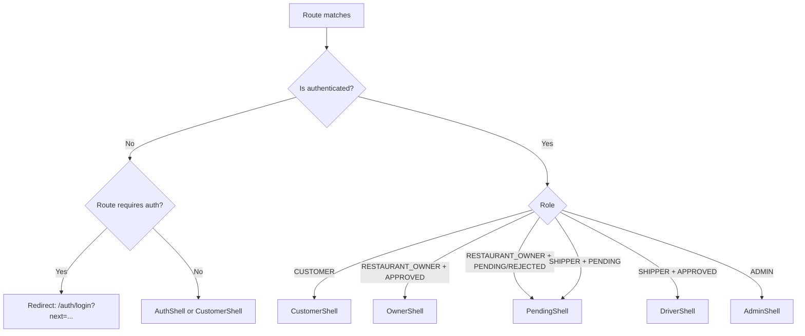
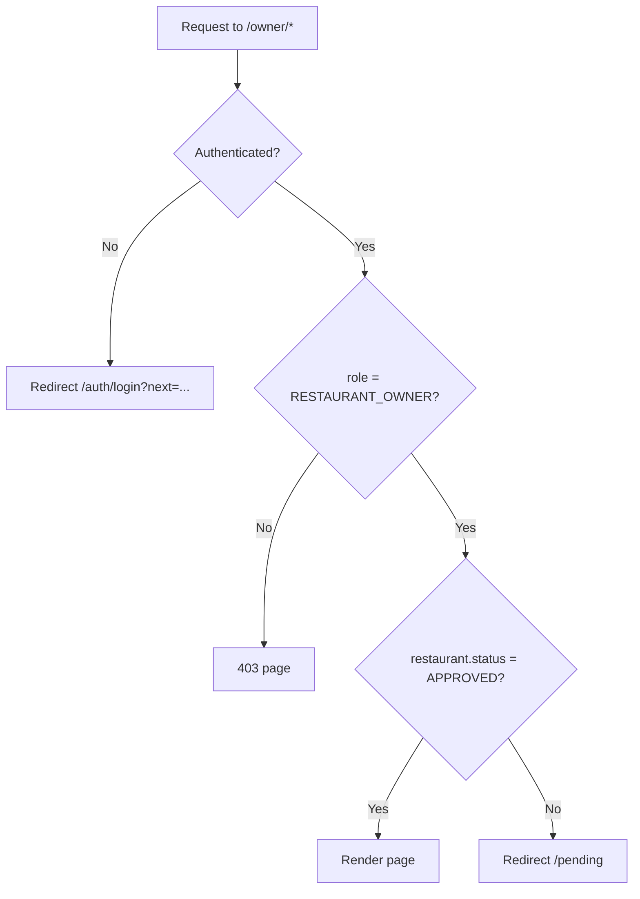
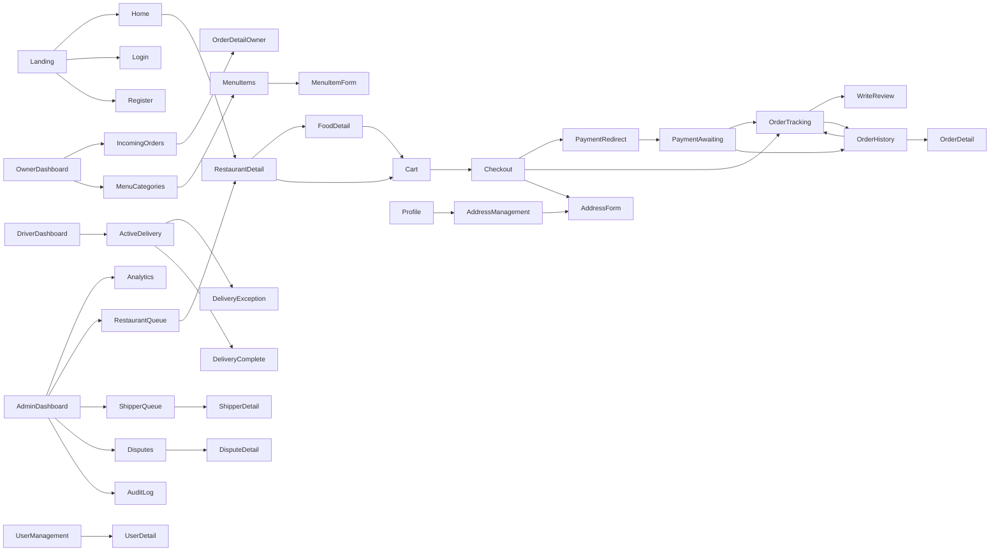

# Navigation Map

Route hierarchy, shell assignments, nav components, deep links, and page relationships for all roles.

---

## Route Hierarchy

```
/
├── auth/
│   ├── login
│   ├── register
│   └── change-password            (authenticated)
│
├── (customer shell)
│   ├── (index) → /restaurants     (Home — Discovery)
│   ├── restaurants/
│   │   └── :restaurantId          (Restaurant Detail + Menu)
│   ├── cart
│   ├── checkout
│   ├── payment/
│   │   ├── redirect/:orderId
│   │   └── awaiting/:orderId
│   ├── orders/
│   │   ├── (index)                (Order History)
│   │   └── :orderId/
│   │       ├── (index)            (Order Tracking / Order Detail)
│   │       └── review
│   ├── profile/
│   │   ├── (index)
│   │   └── addresses/
│   │       ├── (index)
│   │       └── :addressId/edit
│   └── notifications
│
├── owner/                         (OWNER only — SideNav shell)
│   ├── dashboard
│   ├── orders/
│   │   └── :orderId
│   ├── menu/
│   │   ├── categories
│   │   └── items
│   │       ├── new
│   │       └── :itemId/edit
│   ├── settings
│   ├── profile
│   └── notifications
│
├── shipper/                       (DRIVER only — SideNav Rail shell)
│   ├── jobs
│   │   └── :orderId/active
│   ├── earnings
│   ├── profile
│   └── notifications
│
├── admin/                         (ADMIN only — SideNav shell)
│   ├── dashboard
│   ├── analytics
│   ├── restaurants/
│   │   └── :restaurantId
│   ├── shippers/
│   │   └── :shipperId
│   ├── users/
│   │   └── :userId
│   ├── disputes/
│   │   └── :disputeId
│   ├── audit-log
│   └── config
│
└── pending                        (OWNER_PENDING, DRIVER_PENDING)
```

---

## Navigation Shell Assignment

Every screen lives in exactly one shell. The shell determines the persistent navigation chrome.



| Shell | Used By | Components |
|---|---|---|
| `AuthShell` | Login, Register, Pending Approval, Rejection, Approval, Redirect, Awaiting | Logo header only; no nav |
| `CustomerShell` | All Customer screens post-login; Guest on Home/Restaurant Detail | `TopNav` + `BottomNav` (mobile) |
| `OwnerShell` | All Owner screens | `SideNavDrawer` (260px) |
| `DriverShell` | All Driver screens | `SideNavRail` (80px desktop) + `BottomNav` 4-tab (mobile) |
| `AdminShell` | All Admin screens | `SideNavDrawer` (260px) |
| `PendingShell` | Owner/Driver pending approval | `AuthShell` equivalent + Logout only |

---

## TopNav (CustomerShell)

**Present on:** All Customer screens except Payment Redirect and Payment Awaiting (those use `AuthShell`).

| Element | Behaviour |
|---|---|
| Logo | Navigates to `/` (Home) |
| Search bar | Debounced; updates `?search=` query param; visible on Home and collapses to icon elsewhere |
| Notification bell | Badge count (unread); click → `/notifications` |
| Avatar menu | Dropdown: Profile / Change Password / Logout |
| Address selector | Shown on Home; click opens saved-address modal; updates lat/lng query params |

**Scroll behaviour:** `elevation-0` at top of page; transitions to `elevation-1` with `border-bottom` on scroll.

---

## SideNav — Owner and Admin

**Width:** 260px expanded; collapses to overlay on mobile (hamburger in top bar).

### Owner SideNav Items

```
🍜 Foodya (logo — links to /owner/dashboard)
────────────────
● Dashboard          /owner/dashboard
○ Incoming Orders 3  /owner/orders          (badge = PENDING count)
○ Menu               /owner/menu/categories
────────────────
○ Settings           /owner/settings
────────────────
○ Notifications   2  /owner/notifications   (badge = unread count)
○ Profile            /owner/profile
○ Logout
```

### Admin SideNav Items

```
🍜 Foodya Admin (logo — links to /admin/dashboard)
────────────────
● Dashboard          /admin/dashboard
○ Analytics          /admin/analytics
────────────────
APPROVALS
○ Restaurants     5  /admin/restaurants     (badge = PENDING count)
○ Shippers        3  /admin/shippers        (badge = PENDING_APPROVAL count)
────────────────
MODERATION
○ Users              /admin/users
○ Disputes        2  /admin/disputes        (badge = open count)
────────────────
PLATFORM
○ Audit Log          /admin/audit-log
○ Configuration      /admin/config
────────────────
○ Logout
```

---

## SideNav Rail — Driver

**Width:** 80px; icon + label below; never expands on desktop.

```
🍜 (logo)
──────
🛵 Jobs          /shipper/jobs
💰 Earnings      /shipper/earnings
🔔 Alerts     2  /shipper/notifications
👤 Profile       /shipper/profile
```

**Active Delivery override:** When `Order.status = PICKED_UP` for this driver, the `Jobs` item is replaced by:

```
📦 Delivery      /shipper/jobs/:orderId/active
```

---

## BottomNav — Customer Mobile

**Present on:** All Customer screens on viewports < 768px.
**Hidden on:** Checkout, Payment Redirect, Payment Awaiting (focus flow).

| Tab | Icon | Route |
|---|---|---|
| Home | `home` | `/` |
| Orders | `receipt_long` | `/orders` |
| Alerts | `notifications` | `/notifications` |
| Profile | `account_circle` | `/profile` |

Active tab: `color-primary` filled icon. Inactive: `color-on-surface-variant` outlined icon.

---

## BottomNav — Driver Mobile

| Tab | Icon | Route |
|---|---|---|
| Jobs | `pedal_bike` | `/shipper/jobs` |
| Earnings | `account_balance_wallet` | `/shipper/earnings` |
| Alerts | `notifications` | `/shipper/notifications` |
| Profile | `account_circle` | `/shipper/profile` |

---

## Breadcrumbs — Admin

Present on all Admin detail screens (depth > 1). Hidden on mobile.

| Screen | Breadcrumb Trail |
|---|---|
| Restaurant Detail | Restaurants / Pho Hung |
| Shipper Detail | Shippers / Tran Van B |
| User Detail | Users / Nguyen Van A |
| Dispute Detail | Disputes / #974 |
| Audit Log | (flat — no breadcrumb) |

Separator: `chevron_right` icon (16px), `color-on-surface-variant`.

---

## Tab Bars (In-Page)

| Screen | Tabs |
|---|---|
| Restaurant Detail — Customer | All · [Category names] |
| Order History | All · Active · Delivered · Cancelled |
| Admin Analytics | Orders · GMV · Rating Trend |
| Admin Restaurant Queue | Pending · Approved · Rejected · Suspended · All |
| Admin Shipper Queue | Pending · Approved · Rejected · All |
| Admin Disputes | Open · In Review · Resolved · All |

---

## Back Navigation Rules

| Situation | Back Behaviour | Reason |
|---|---|---|
| Standard screens | Browser back | No side effects |
| Order Tracking | Explicit `← back` link to `/orders` | Avoids re-triggering SSE subscription on history traversal |
| Active Delivery | `← back` with `ConfirmDialog` | Driver assignment persists; must not appear abandoned |
| Checkout | Browser back to `/cart` | Safe; cart state unchanged |
| Modal (Food Detail, Review, Address Form in Checkout) | Close button dismisses modal; route unchanged | Modal is not a route change |
| Payment Awaiting | `← back` blocked; Redirect only to `/orders` | Order already created; "back" to checkout is meaningless |

---

## Deep Links from Notifications

| Notification Event | Recipient | Target Route |
|---|---|---|
| New order placed | OWNER | `/owner/orders/:orderId` |
| Order confirmed | CUSTOMER | `/orders/:orderId` |
| Order rejected | CUSTOMER | `/orders/:orderId` |
| Payment confirmed | CUSTOMER | `/orders/:orderId` |
| Payment failed | CUSTOMER | `/payment/awaiting/:orderId` |
| Shipper assigned | CUSTOMER | `/orders/:orderId` |
| Order picked up | CUSTOMER | `/orders/:orderId` |
| Order delivered | CUSTOMER | `/orders/:orderId` |
| Order cancelled by customer (PENDING) | OWNER | `/owner/orders` |
| Order cancelled by customer (CONFIRMED) | OWNER | `/owner/orders/:orderId` |
| New job available | DRIVER | `/shipper/jobs` |
| Delivery confirmed | DRIVER | `/shipper/earnings` |
| Restaurant approved | OWNER | `/owner/dashboard` |
| Restaurant rejected | OWNER | `/pending` |
| Restaurant suspended | OWNER | `/owner/dashboard` |
| Shipper approved | DRIVER | `/shipper/jobs` |
| Shipper rejected | DRIVER | `/pending` |
| Dispute opened | ADMIN | `/admin/disputes` |
| Refund issued | CUSTOMER | `/orders/:orderId` |

---

## Route Guard Logic



Same pattern applies for `/shipper/*` (role = SHIPPER + ShipperProfile.status = APPROVED) and `/admin/*` (role = ADMIN).

---

## Page Relationships Diagram


