# User Flows

All approved user flows. Grouped by role. Each flow includes a Mermaid diagram, goal, trigger, main flow, alternative flows, exception flows, and exit conditions.

---

## Customer Flows

### CF-01 — Register

**Goal:** Create a Customer account.
**Trigger:** Click "Sign up" → select Customer role.

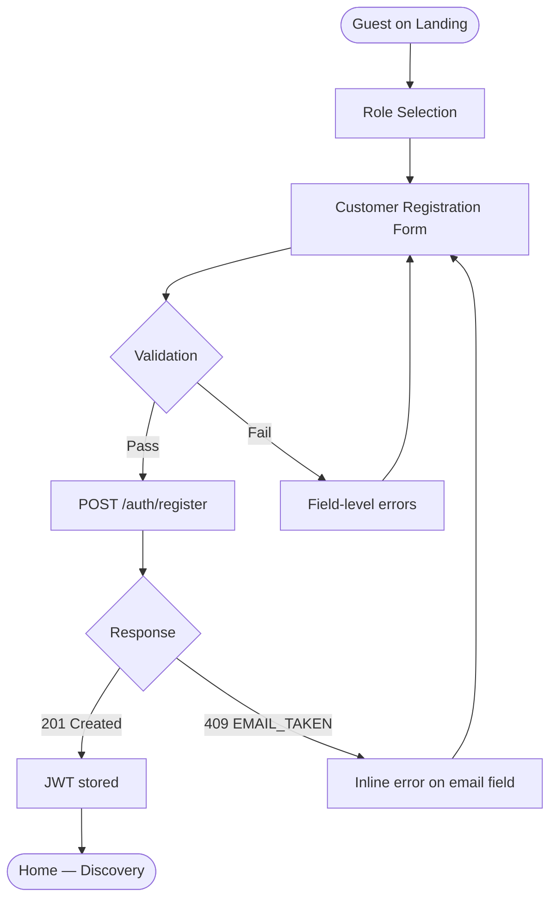
```mermaid
flowchart TD
    A([Guest on Landing]) --> B[Role Selection]
    B --> C[Customer Registration Form]
    C --> D{Validation}
    D -- Pass --> E[POST /auth/register]
    E --> F{Response}
    F -- 201 Created --> G[JWT stored]
    G --> H([Home — Discovery])
    F -- 409 EMAIL_TAKEN --> I[Inline error on email field]
    I --> C
    D -- Fail --> J[Field-level errors]
    J --> C
```

**Main Flow:** Submit name, email, phone, password → JWT issued → redirect to Home.
**Alternative:** Email taken (409) → inline error, no navigation.
**Exit:** Home screen.

---

### CF-02 — Login

**Goal:** Authenticate an existing user of any role.
**Trigger:** Navigate to `/auth/login` directly or via protected-route redirect.

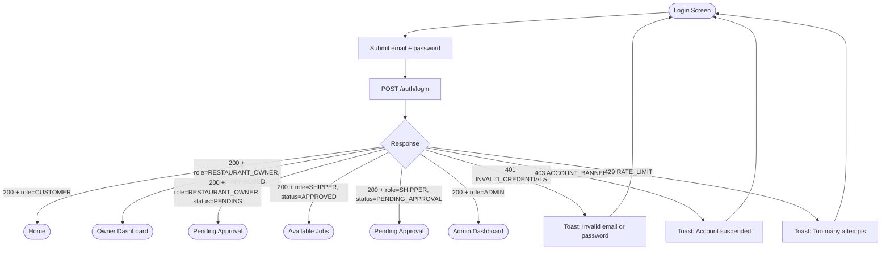
```mermaid
flowchart TD
    A([Login Screen]) --> B[Submit email + password]
    B --> C[POST /auth/login]
    C --> D{Response}
    D -- 200 + role=CUSTOMER --> E([Home])
    D -- 200 + role=RESTAURANT_OWNER, status=APPROVED --> F([Owner Dashboard])
    D -- 200 + role=RESTAURANT_OWNER, status=PENDING --> G([Pending Approval])
    D -- 200 + role=SHIPPER, status=APPROVED --> H([Available Jobs])
    D -- 200 + role=SHIPPER, status=PENDING_APPROVAL --> I([Pending Approval])
    D -- 200 + role=ADMIN --> J([Admin Dashboard])
    D -- 401 INVALID_CREDENTIALS --> K[Toast: Invalid email or password]
    K --> A
    D -- 403 ACCOUNT_BANNED --> L[Toast: Account suspended]
    L --> A
    D -- 429 RATE_LIMIT --> M[Toast: Too many attempts]
    M --> A
```

**Main Flow:** Email + password → role-based redirect.
**Alternatives:** Wrong credentials (401), banned account (403), rate limit (429).
**Exit:** Role-appropriate home screen.

---

### CF-03 — Browse and Search Restaurants

**Goal:** Find restaurants to order from.
**Trigger:** Home screen loads or search term/filter changes.

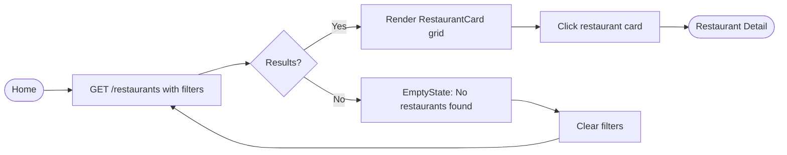
```mermaid
flowchart LR
    A([Home]) --> B[GET /restaurants with filters]
    B --> C{Results?}
    C -- Yes --> D[Render RestaurantCard grid]
    C -- No --> E[EmptyState: No restaurants found]
    D --> F[Click restaurant card]
    F --> G([Restaurant Detail])
    E --> H[Clear filters]
    H --> B
```

**Main Flow:** Load restaurants with optional lat/lng/search/cuisine/rating/sortBy → paginated grid → click to Restaurant Detail.
**Alternative:** No results → EmptyState + "Clear filters" CTA.
**Exception:** Network error → inline error banner + Retry.

---

### CF-04 — Add to Cart and Manage Cart

**Goal:** Build an order from one restaurant.
**Trigger:** Click "+ Add" on a menu item or tap Food Detail modal CTA.

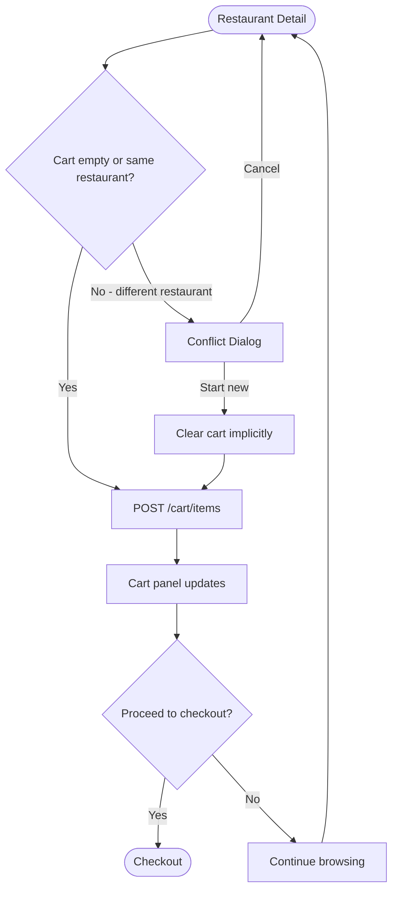
```mermaid
flowchart TD
    A([Restaurant Detail]) --> B{Cart empty or same restaurant?}
    B -- Yes --> C[POST /cart/items]
    B -- No - different restaurant --> D[Conflict Dialog]
    D -- Start new --> E[Clear cart implicitly]
    E --> C
    D -- Cancel --> A
    C --> F[Cart panel updates]
    F --> G{Proceed to checkout?}
    G -- Yes --> H([Checkout])
    G -- No --> I[Continue browsing]
    I --> A
```

**Main Flow:** Add item → cart panel updates → optional: proceed to Checkout.
**Alternative:** Different restaurant in cart → conflict dialog → "Start new" clears existing cart.
**Business Rule (BR-05):** Cart is scoped to one restaurant at a time.

---

### CF-05 — Checkout and Place Order

**Goal:** Complete an order with delivery address and payment method.
**Trigger:** Cart → "Proceed to Checkout."

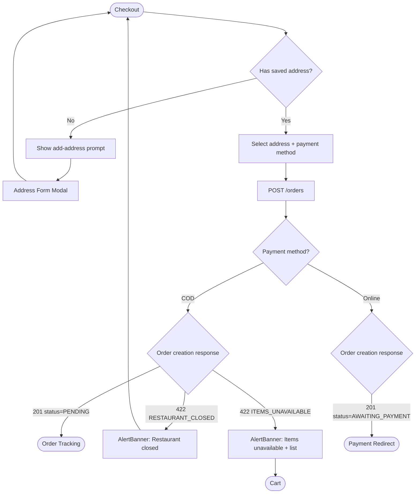
```mermaid
flowchart TD
    A([Checkout]) --> B{Has saved address?}
    B -- No --> C[Show add-address prompt]
    C --> D[Address Form Modal]
    D --> A
    B -- Yes --> E[Select address + payment method]
    E --> F[POST /orders]
    F --> G{Payment method?}
    G -- COD --> H{Order creation response}
    G -- Online --> I{Order creation response}
    H -- 201 status=PENDING --> J([Order Tracking])
    H -- 422 RESTAURANT_CLOSED --> K[AlertBanner: Restaurant closed]
    H -- 422 ITEMS_UNAVAILABLE --> L[AlertBanner: Items unavailable + list]
    I -- 201 status=AWAITING_PAYMENT --> M([Payment Redirect])
    K --> A
    L --> N([Cart])
```

**Main Flow (COD):** Select address → COD → POST /orders → PENDING → Order Tracking.
**Main Flow (Online):** Select address → Online + provider → POST /orders → AWAITING_PAYMENT → Payment Redirect.
**Alternatives:** Restaurant closed (422), items unavailable (422), no address.

---

### CF-06 — Online Payment

**Goal:** Complete payment via VNPay or Momo.
**Trigger:** Checkout → Online payment → order created.

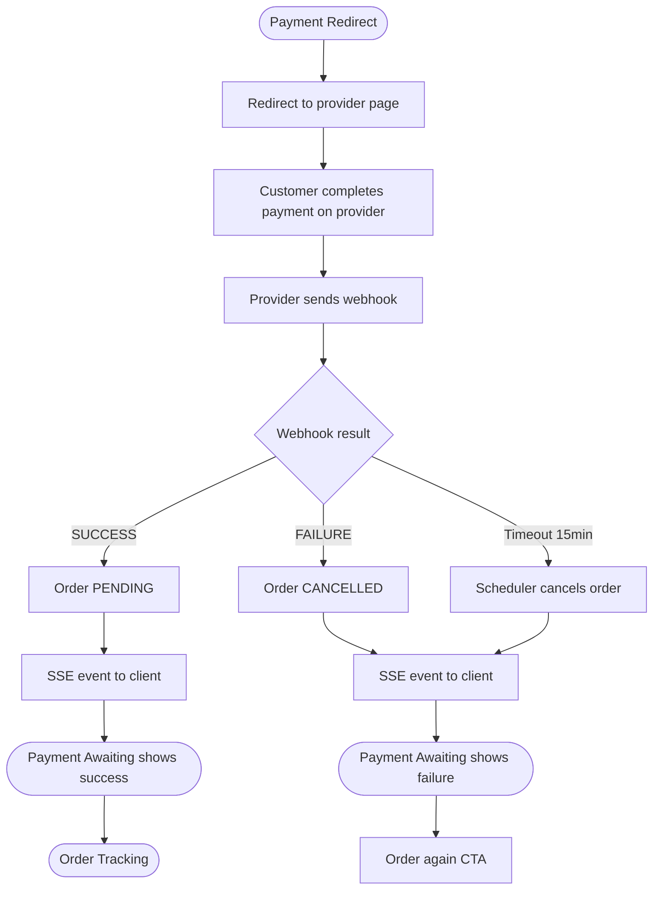
```mermaid
flowchart TD
    A([Payment Redirect]) --> B[Redirect to provider page]
    B --> C[Customer completes payment on provider]
    C --> D[Provider sends webhook]
    D --> E{Webhook result}
    E -- SUCCESS --> F[Order PENDING]
    F --> G[SSE event to client]
    G --> H([Payment Awaiting shows success])
    H --> I([Order Tracking])
    E -- FAILURE --> J[Order CANCELLED]
    J --> K[SSE event to client]
    K --> L([Payment Awaiting shows failure])
    L --> M[Order again CTA]
    E -- Timeout 15min --> N[Scheduler cancels order]
    N --> K
```

**Business Rule (BR-24):** 15-minute timeout cancels order with `PAYMENT_TIMEOUT`.
**Business Rule (BR-29):** No payment retry on same order — customer must reorder.
**Exit:** Order Tracking (success) or Order History (failure).

---

### CF-07 — Track Order

**Goal:** Monitor live order status and shipper location.
**Trigger:** Post-checkout redirect, notification deep-link.

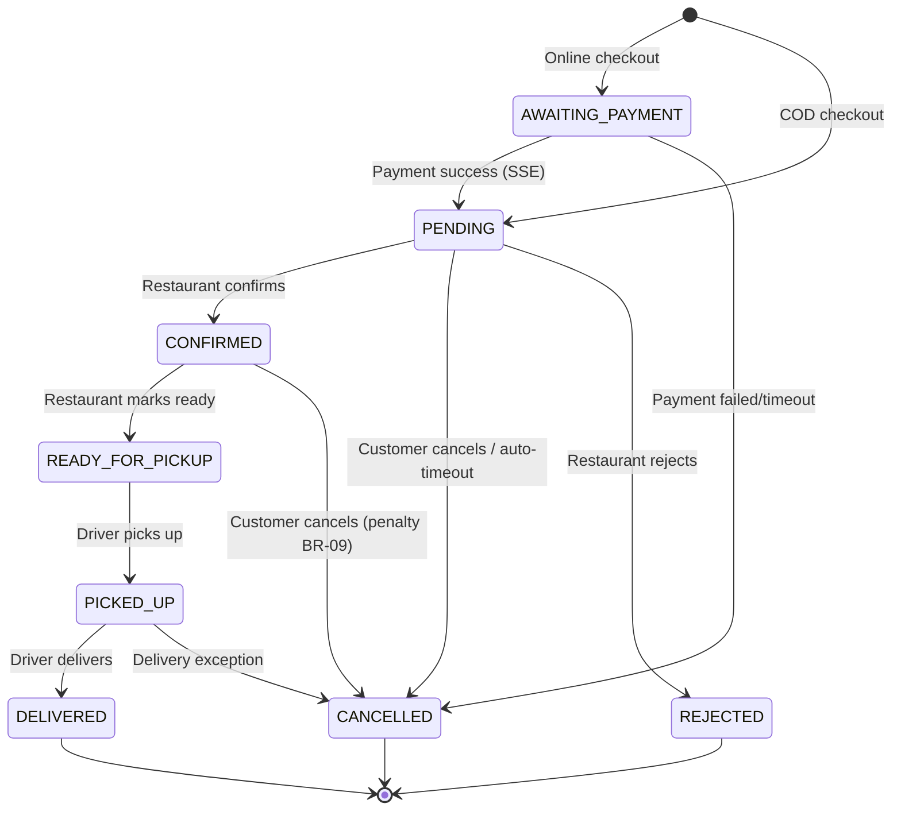
```mermaid
stateDiagram-v2
    [*] --> AWAITING_PAYMENT : Online checkout
    [*] --> PENDING : COD checkout
    AWAITING_PAYMENT --> PENDING : Payment success (SSE)
    AWAITING_PAYMENT --> CANCELLED : Payment failed/timeout
    PENDING --> CONFIRMED : Restaurant confirms
    PENDING --> CANCELLED : Customer cancels / auto-timeout
    PENDING --> REJECTED : Restaurant rejects
    CONFIRMED --> READY_FOR_PICKUP : Restaurant marks ready
    CONFIRMED --> CANCELLED : Customer cancels (penalty BR-09)
    READY_FOR_PICKUP --> PICKED_UP : Driver picks up
    PICKED_UP --> DELIVERED : Driver delivers
    PICKED_UP --> CANCELLED : Delivery exception
    DELIVERED --> [*]
    REJECTED --> [*]
    CANCELLED --> [*]
```

**SSE Events:** `ORDER_STATUS_CHANGED`, `LOCATION_UPDATED`.
**Cancel eligibility:** `AWAITING_PAYMENT`, `PENDING`, `CONFIRMED` only.
**Exit:** Order History (terminal), Write Review (DELIVERED).

---

### CF-08 — Cancel Order

**Goal:** Cancel an in-progress order.
**Trigger:** Order Tracking "Cancel order" button.

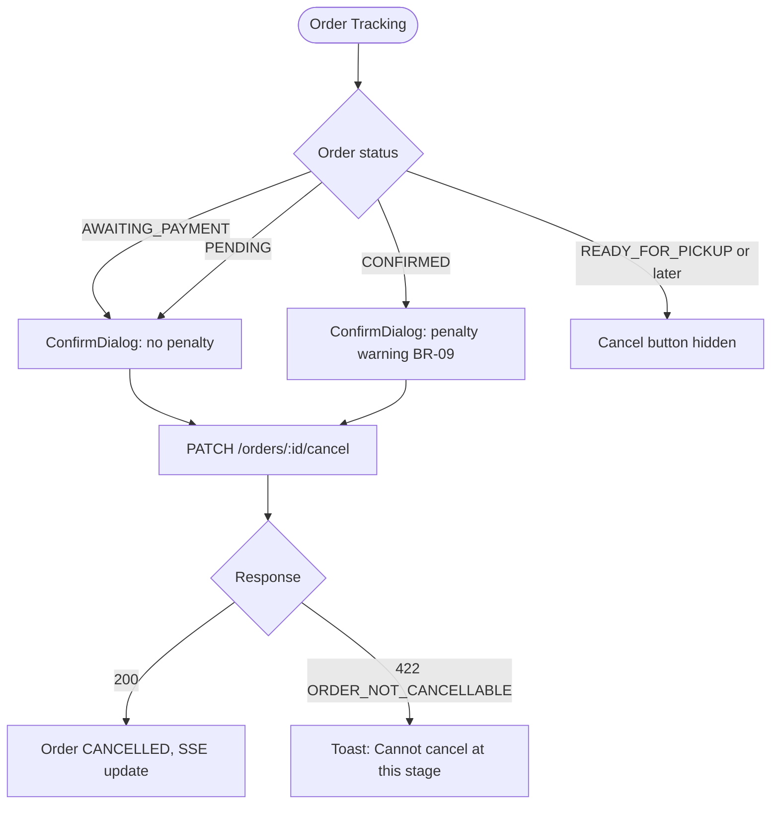
```mermaid
flowchart TD
    A([Order Tracking]) --> B{Order status}
    B -- AWAITING_PAYMENT --> C[ConfirmDialog: no penalty]
    B -- PENDING --> C
    B -- CONFIRMED --> D[ConfirmDialog: penalty warning BR-09]
    B -- READY_FOR_PICKUP or later --> E[Cancel button hidden]
    C --> F[PATCH /orders/:id/cancel]
    D --> F
    F --> G{Response}
    G -- 200 --> H[Order CANCELLED, SSE update]
    G -- 422 ORDER_NOT_CANCELLABLE --> I[Toast: Cannot cancel at this stage]
```

**Business Rule (BR-09):** Cancelling a CONFIRMED order increments the customer's 30-day penalty counter.

---

### CF-09 — Write Review

**Goal:** Rate a restaurant after delivery.
**Trigger:** Order delivered → review prompt CTA.

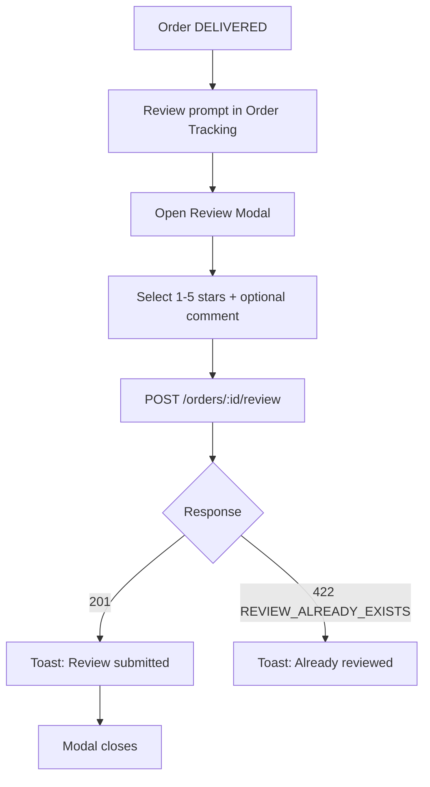
```mermaid
flowchart TD
    A[Order DELIVERED] --> B[Review prompt in Order Tracking]
    B --> C[Open Review Modal]
    C --> D[Select 1-5 stars + optional comment]
    D --> E[POST /orders/:id/review]
    E --> F{Response}
    F -- 201 --> G[Toast: Review submitted]
    G --> H[Modal closes]
    F -- 422 REVIEW_ALREADY_EXISTS --> I[Toast: Already reviewed]
```

**Business Rule (BR-15):** One review per order, only when `Order.status = DELIVERED`.

---

## Restaurant Owner Flows

### OF-01 — Register Restaurant

**Goal:** Submit restaurant for admin approval.
**Trigger:** Role Selection → "Restaurant Owner."

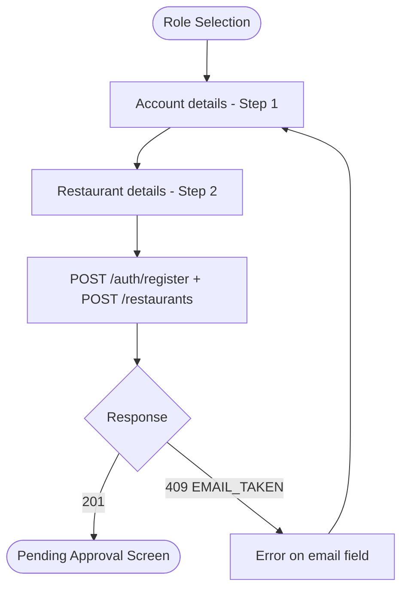
```mermaid
flowchart TD
    A([Role Selection]) --> B[Account details - Step 1]
    B --> C[Restaurant details - Step 2]
    C --> D[POST /auth/register + POST /restaurants]
    D --> E{Response}
    E -- 201 --> F([Pending Approval Screen])
    E -- 409 EMAIL_TAKEN --> G[Error on email field]
    G --> B
```

---

### OF-02 — Approval Gate

**Goal:** Unblock dashboard access when admin approves.
**Trigger:** Admin approves/rejects the restaurant.

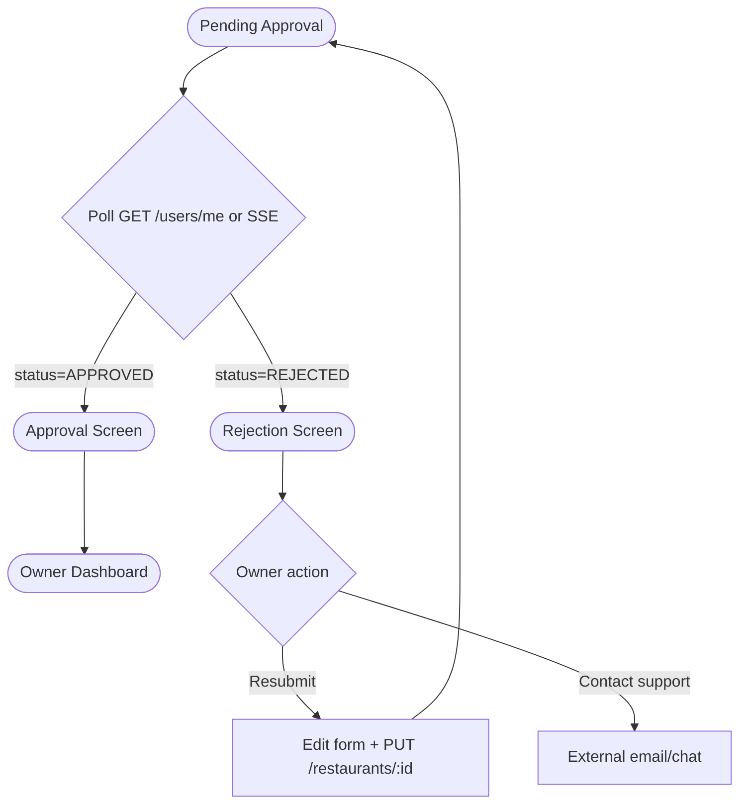
```mermaid
flowchart TD
    A([Pending Approval]) --> B{Poll GET /users/me or SSE}
    B -- status=APPROVED --> C([Approval Screen])
    C --> D([Owner Dashboard])
    B -- status=REJECTED --> E([Rejection Screen])
    E --> F{Owner action}
    F -- Resubmit --> G[Edit form + PUT /restaurants/:id]
    G --> A
    F -- Contact support --> H[External email/chat]
```

---

### OF-03 — Handle Incoming Order

**Goal:** Confirm or reject a new order within 5 minutes.
**Trigger:** New order notification / SSE event.

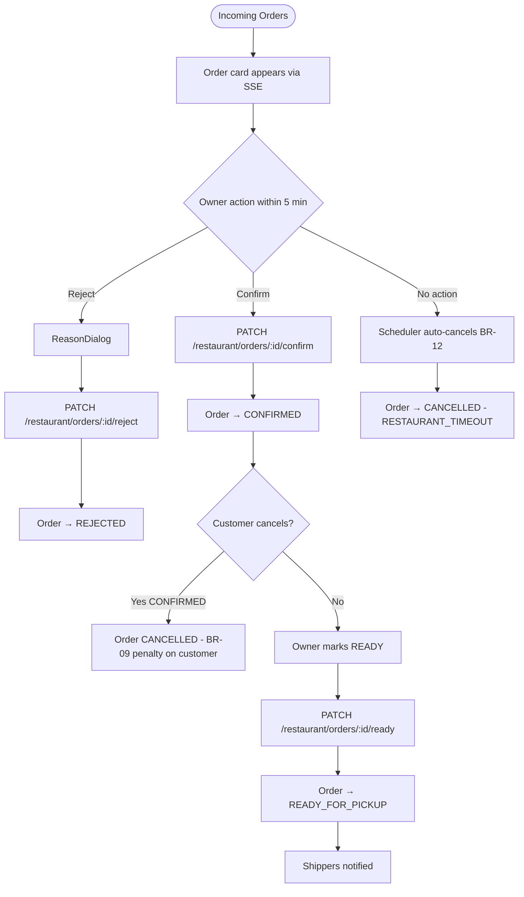
```mermaid
flowchart TD
    A([Incoming Orders]) --> B[Order card appears via SSE]
    B --> C{Owner action within 5 min}
    C -- Confirm --> D[PATCH /restaurant/orders/:id/confirm]
    C -- Reject --> E[ReasonDialog]
    E --> F[PATCH /restaurant/orders/:id/reject]
    C -- No action --> G[Scheduler auto-cancels BR-12]
    D --> H[Order → CONFIRMED]
    F --> I[Order → REJECTED]
    G --> J[Order → CANCELLED - RESTAURANT_TIMEOUT]
    H --> K{Customer cancels?}
    K -- Yes CONFIRMED --> L[Order CANCELLED - BR-09 penalty on customer]
    K -- No --> M[Owner marks READY]
    M --> N[PATCH /restaurant/orders/:id/ready]
    N --> O[Order → READY_FOR_PICKUP]
    O --> P[Shippers notified]
```

**Business Rule (BR-11):** 5-minute response window.
**Business Rule (BR-12):** Auto-cancel on no response.

---

### OF-04 — Manage Menu

**Goal:** Keep menu categories and items current.

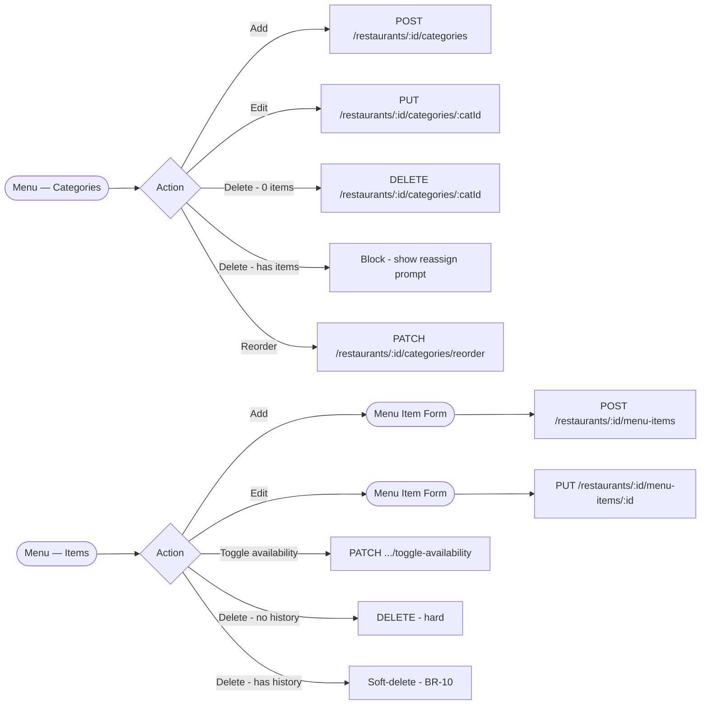
```mermaid
flowchart LR
    A([Menu — Categories]) --> B{Action}
    B -- Add --> C[POST /restaurants/:id/categories]
    B -- Edit --> D[PUT /restaurants/:id/categories/:catId]
    B -- Delete - 0 items --> E[DELETE /restaurants/:id/categories/:catId]
    B -- Delete - has items --> F[Block - show reassign prompt]
    B -- Reorder --> G[PATCH /restaurants/:id/categories/reorder]

    H([Menu — Items]) --> I{Action}
    I -- Add --> J([Menu Item Form])
    J --> K[POST /restaurants/:id/menu-items]
    I -- Edit --> L([Menu Item Form])
    L --> M[PUT /restaurants/:id/menu-items/:id]
    I -- Toggle availability --> N[PATCH .../toggle-availability]
    I -- Delete - no history --> O[DELETE - hard]
    I -- Delete - has history --> P[Soft-delete - BR-10]
```

---

## Driver Flows

### DF-01 — Register and Approval

**Goal:** Become an approved driver.
**Trigger:** Role Selection → "Shipper."

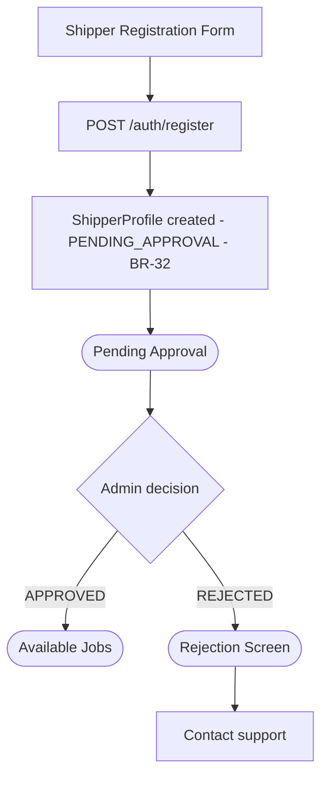
```mermaid
flowchart TD
    A[Shipper Registration Form] --> B[POST /auth/register]
    B --> C[ShipperProfile created - PENDING_APPROVAL - BR-32]
    C --> D([Pending Approval])
    D --> E{Admin decision}
    E -- APPROVED --> F([Available Jobs])
    E -- REJECTED --> G([Rejection Screen])
    G --> H[Contact support]
```

---

### DF-02 — Accept and Complete Delivery

**Goal:** Pick up and deliver an order.
**Trigger:** Tap "Accept delivery" on a job card.

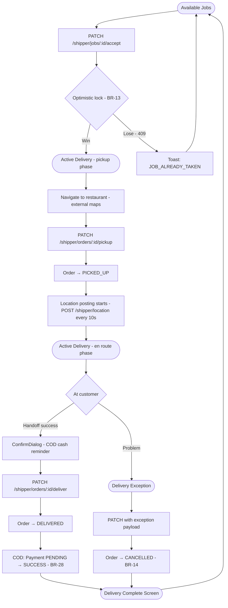
```mermaid
flowchart TD
    A([Available Jobs]) --> B[PATCH /shipper/jobs/:id/accept]
    B --> C{Optimistic lock - BR-13}
    C -- Win --> D([Active Delivery - pickup phase])
    C -- Lose - 409 --> E[Toast: JOB_ALREADY_TAKEN]
    E --> A

    D --> F[Navigate to restaurant - external maps]
    F --> G[PATCH /shipper/orders/:id/pickup]
    G --> H[Order → PICKED_UP]
    H --> I[Location posting starts - POST /shipper/location every 10s]
    I --> J([Active Delivery - en route phase])
    J --> K{At customer}
    K -- Handoff success --> L[ConfirmDialog - COD cash reminder]
    L --> M[PATCH /shipper/orders/:id/deliver]
    M --> N[Order → DELIVERED]
    N --> O[COD: Payment PENDING → SUCCESS - BR-28]
    O --> P([Delivery Complete Screen])
    P --> A

    K -- Problem --> Q([Delivery Exception])
    Q --> R[PATCH with exception payload]
    R --> S[Order → CANCELLED - BR-14]
    S --> P
```

---

### DF-03 — Live Location Updates

**Goal:** Broadcast shipper location to customer during delivery.
**Trigger:** Order status transitions to `PICKED_UP`.

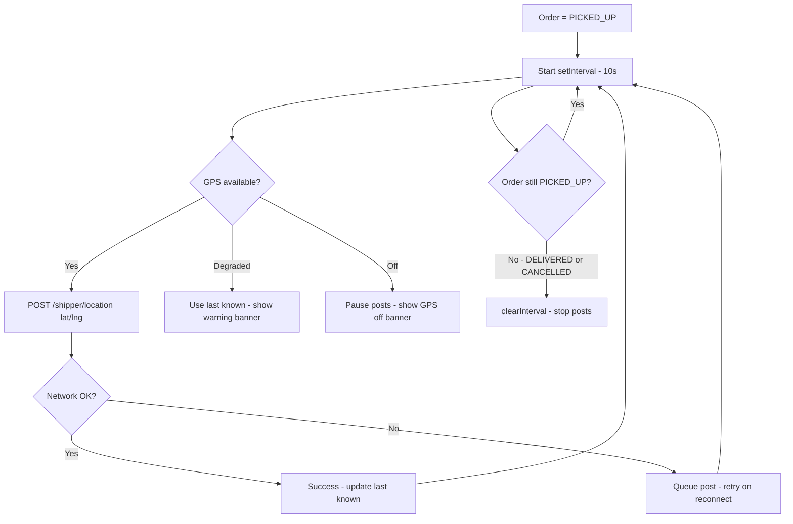
```mermaid
flowchart TD
    A[Order = PICKED_UP] --> B[Start setInterval - 10s]
    B --> C{GPS available?}
    C -- Yes --> D[POST /shipper/location lat/lng]
    C -- Degraded --> E[Use last known - show warning banner]
    C -- Off --> F[Pause posts - show GPS off banner]
    D --> G{Network OK?}
    G -- Yes --> H[Success - update last known]
    G -- No --> I[Queue post - retry on reconnect]
    H --> B
    I --> B
    B --> J{Order still PICKED_UP?}
    J -- No - DELIVERED or CANCELLED --> K[clearInterval - stop posts]
    J -- Yes --> B
```

---

## Admin Flows

### AF-01 — Restaurant Approval Loop

**Goal:** Approve or reject restaurant applications.

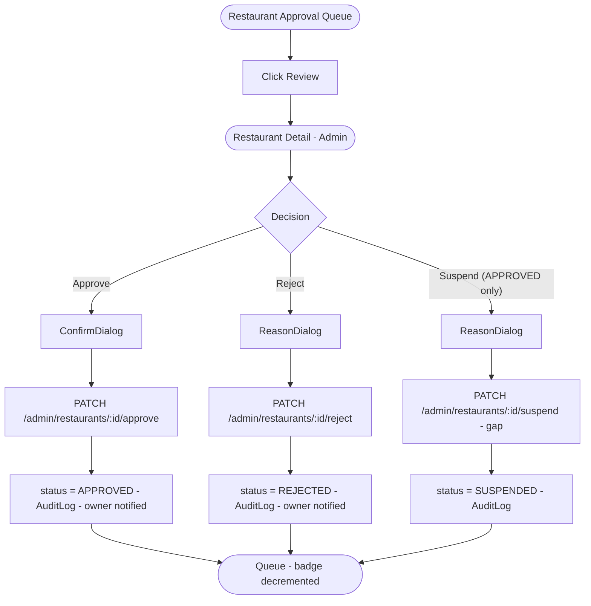
```mermaid
flowchart TD
    A([Restaurant Approval Queue]) --> B[Click Review]
    B --> C([Restaurant Detail - Admin])
    C --> D{Decision}
    D -- Approve --> E[ConfirmDialog]
    E --> F[PATCH /admin/restaurants/:id/approve]
    F --> G[status = APPROVED - AuditLog - owner notified]
    D -- Reject --> H[ReasonDialog]
    H --> I[PATCH /admin/restaurants/:id/reject]
    I --> J[status = REJECTED - AuditLog - owner notified]
    D -- Suspend (APPROVED only) --> K[ReasonDialog]
    K --> L[PATCH /admin/restaurants/:id/suspend - gap]
    L --> M[status = SUSPENDED - AuditLog]
    G --> N([Queue - badge decremented])
    J --> N
    M --> N
```

---

### AF-02 — User Ban / Unban

**Goal:** Moderate a user account.

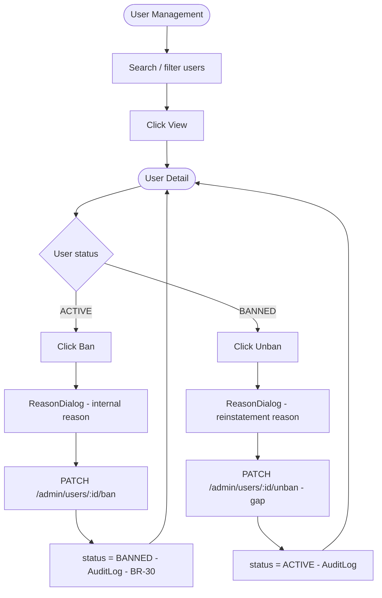
```mermaid
flowchart TD
    A([User Management]) --> B[Search / filter users]
    B --> C[Click View]
    C --> D([User Detail])
    D --> E{User status}
    E -- ACTIVE --> F[Click Ban]
    F --> G[ReasonDialog - internal reason]
    G --> H[PATCH /admin/users/:id/ban]
    H --> I[status = BANNED - AuditLog - BR-30]
    E -- BANNED --> J[Click Unban]
    J --> K[ReasonDialog - reinstatement reason]
    K --> L[PATCH /admin/users/:id/unban - gap]
    L --> M[status = ACTIVE - AuditLog]
    I --> D
    M --> D
```

---

### AF-03 — Dispute Resolution

**Goal:** Investigate and close a flagged order or review.

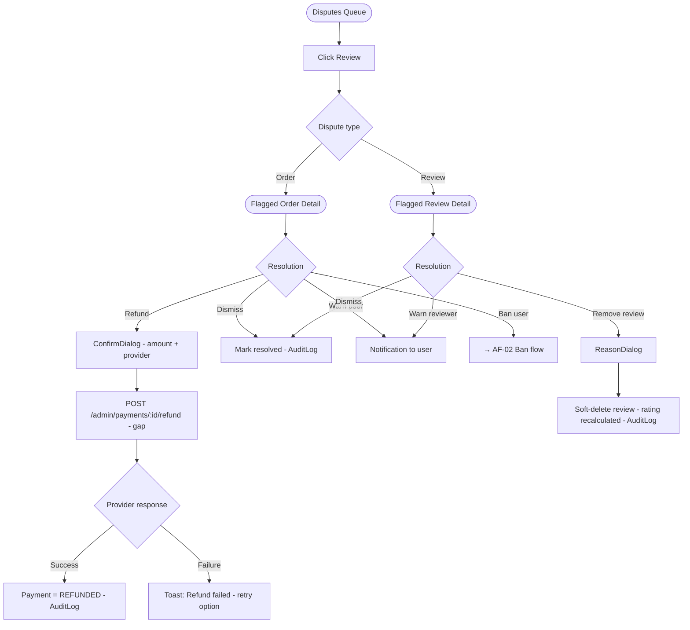
```mermaid
flowchart TD
    A([Disputes Queue]) --> B[Click Review]
    B --> C{Dispute type}
    C -- Order --> D([Flagged Order Detail])
    C -- Review --> E([Flagged Review Detail])

    D --> F{Resolution}
    F -- Refund --> G[ConfirmDialog - amount + provider]
    G --> H[POST /admin/payments/:id/refund - gap]
    H --> I{Provider response}
    I -- Success --> J[Payment = REFUNDED - AuditLog]
    I -- Failure --> K[Toast: Refund failed - retry option]
    F -- Dismiss --> L[Mark resolved - AuditLog]
    F -- Warn user --> M[Notification to user]
    F -- Ban user --> N[→ AF-02 Ban flow]

    E --> O{Resolution}
    O -- Remove review --> P[ReasonDialog]
    P --> Q[Soft-delete review - rating recalculated - AuditLog]
    O -- Dismiss --> L
    O -- Warn reviewer --> M
```

---

## Shared Flows

### SF-01 — Logout

**Goal:** End session; revoke refresh token.
**Trigger:** Any nav shell "Logout" item.

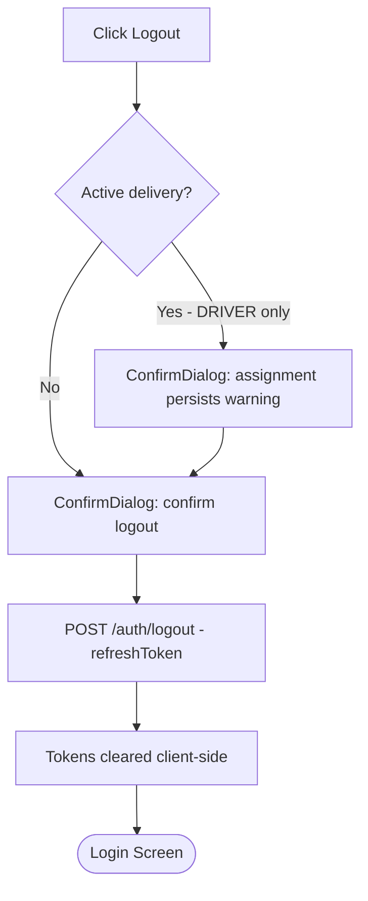
```mermaid
flowchart TD
    A[Click Logout] --> B{Active delivery?}
    B -- Yes - DRIVER only --> C[ConfirmDialog: assignment persists warning]
    B -- No --> D[ConfirmDialog: confirm logout]
    C --> D
    D --> E[POST /auth/logout - refreshToken]
    E --> F[Tokens cleared client-side]
    F --> G([Login Screen])
```

---

### SF-02 — Notifications

**Goal:** Read and act on in-app notifications.

```mermaid
flowchart TD
    A([Notifications Screen]) --> B[GET /notifications]
    B --> C[Render NotificationItem list]
    C --> D{User action}
    D -- Tap item --> E[PATCH /notifications/:id/read]
    E --> F[Navigate to deep-link target]
    D -- Mark all read --> G[PATCH /notifications/read-all]
    G --> H[All items updated in UI]
```

---

## Exception Flows (Cross-Role)

| Exception | Trigger | System Response | UI Response |
|---|---|---|---|
| Network offline | Any API call | Request fails | `AlertBanner`: "No connection." Retry CTA. State actions blocked. |
| JWT expired | Any authenticated request | 401 response | Auto-refresh via `POST /auth/refresh`; if refresh also fails → logout |
| Session conflict (concurrent) | Two admins action same entity | 422 on second action | Banner: "Already actioned by another admin." Buttons disabled. |
| Item goes unavailable mid-cart | Customer at checkout | 422 ITEMS_UNAVAILABLE | List of affected items shown; redirect to Cart |
| Race condition on job accept | Two drivers tap Accept | 409 JOB_ALREADY_TAKEN | Toast; driver returns to job list |
| Payment provider timeout | No webhook within 15 min | Scheduler cancels order | SSE event → Payment Awaiting shows failure state |
